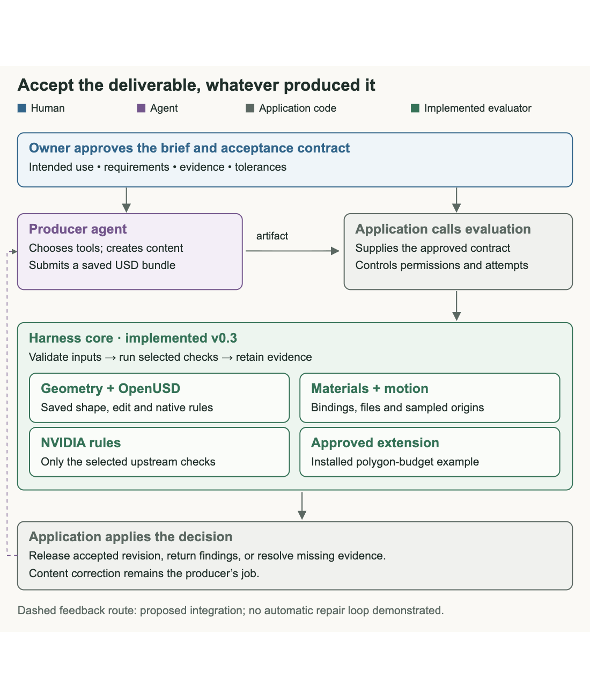

# Scene Acceptance

An extensible acceptance harness for applications that delegate 3D content production to an agent.

I want the application to own what a deliverable must satisfy while the producer chooses how to build it. This project evaluates a saved OpenUSD bundle against an explicit contract, runs the selected evaluation packs and returns findings tied to the submitted revision. The application can use those findings to accept the artifact, request evidence or send a new brief to its producer.

**Status:** experimental, version 0.4.0 development. The harness evaluates content; the producer owns revisions. Its current packs cover bounded geometry, material delivery, sampled motion, explicit timing requirements and selected OpenUSD/NVIDIA rules. Texture decoding and simulated behavior are separate, reproducible experiments. The [v0.3.0 release](https://github.com/pr9868/scene-acceptance/releases/tag/v0.3.0) remains unchanged.

The [timing walkthrough](docs/MOTION_TIMING.md) reproduces a gap in a time-code-only contract, then rejects a changed playback rate while accepting a correctly rescaled animation. Producer prechecks may use the same harness; the consuming application still owns the approved requirements and acceptance of the delivered revision. Shared validators can share bugs, so reference cases and coverage review remain necessary.



Blue is human responsibility, purple is the producer agent, gray is application code and green is acceptance. The feedback loop is an application integration design; this release does not run a producer automatically.

## Try a passing edit and a rejected edit

Use Python 3.12. These commands install the core and its pinned test dependencies; NVIDIA and the experiment tools are optional for this first example.

```bash
git clone --branch codex/motion-timing https://github.com/pr9868/scene-acceptance.git
cd scene-acceptance
python3.12 -m venv .venv
source .venv/bin/activate
python -m pip install -r requirements-test.lock
python -m pip install --no-deps --no-build-isolation .

check-3d \
  --bundle-root evaluation/mesh-v1/fixtures/translated_mesh \
  --contract contract.json --candidate scene.usda \
  --baseline baseline.usda --out /tmp/scene-accepted-01
```

Expected: `ACCEPT_FOR_USE`, exit code 0. Open `/tmp/scene-accepted-01/report.html` to see the requirements and their individual results.

Now check an edit whose outer dimensions are right but whose interior changed:

```bash
check-3d \
  --bundle-root evaluation/mesh-v1/fixtures/interior_shape_changed_same_bounds \
  --contract contract.json --candidate scene.usda \
  --baseline baseline.usda --out /tmp/scene-rejected-01
```

Expected: `REJECT`, exit code 2. Six checks pass; shape preservation fails because an interior point moved by 40 mm. This is a deliberately constructed evaluator test, not an observed agent failure.


Choose a new output directory for each run. Outputs must be outside the submitted bundle. Relative input paths resolve inside `--bundle-root`. A command-line usage error also returns 2, so an integration must inspect the structured report rather than interpreting an exit code alone.

## How it fits into an application


The core validates the contract, admits supported inputs, resolves approved packs, runs checks in prerequisite order and produces `result.json`, `report.html` and a manifest. Required checks determine the overall result; advisory findings remain visible. A failed prerequisite leaves its dependent checks unresolved.

| Result | What the caller can conclude |
|---|---|
| `ACCEPT_FOR_USE` | The required checks passed for this contract and submitted revision. Unchecked properties remain outside that conclusion. |
| `REJECT` | A required check found a violation. Other errors or missing evidence remain visible. |
| `INSUFFICIENT_EVIDENCE` | A required obligation could not be established from the supplied evidence. |
| `EVALUATION_ERROR` | Input, integrity or evaluator problems prevent a valid acceptance result. |

The caller owns the brief, approved providers, references, retry policy and release. Packs execute trusted Python in-process. There is no hostile-plugin sandbox, enforced execution timeout, worker scheduler or automatic repair loop.

## Evaluation packs

| Pack | Included evaluation | Current limit |
|---|---|---|
| `openusd` | Explicitly selected native validators | The selected rules' scope; a clean result does not establish every requirement in a brief. |
| `geometry` | Cube and polygon geometry, placement, bounds and declared edit constraints | Bounded representations; shape-preserving translation uses corresponding points/connectivity. |
| `materials` | Resolved bindings, expected surface shader IDs and declared dependencies | No texture decoding, UV or rendered appearance acceptance. |
| `motion` | World-space transform origins at contract-specified time codes | No whole-interval collision, orientation or dynamics proof. |
| `motion.timing` | Authored duration, optional exact clock rate, and sampled origins at elapsed seconds | Separate from the legacy time-code check; does not infer active motion duration or prove a continuous path. |
| `nvidia.asset-validator` | Explicitly selected NVIDIA USD Validation rules | Optional dependency; no SimReady certification or automatic fixers. |
| `studio.mesh-budget` | A separately installed example of a consumer's polygon budget | Example extension; face count does not establish rendering performance. |

Inspect the installed catalogue:

```bash
check-3d-packs
check-3d-packs --upstream openusd
python -m pip install '.[nvidia]'
check-3d-packs --upstream nvidia
```

Available names describe discoverability. They do not mean that every upstream rule has been exercised. A required but unavailable provider produces an evaluation error.

OpenUSD and NVIDIA validators already cover more than syntax and allow custom rules. This project combines their selected results with application requirements, evidence and revision identity. It does not claim a new category of semantic validation.

## Libraries and why I included them

| Library | Role |
|---|---|
| OpenUSD (`usd-core` 25.11) | Compose admitted scenes, inspect geometry/materials/transforms and run selected native validators. |
| JSON Schema (`jsonschema` 4.25.1) | Validate contracts, parameters and structured records. |
| NVIDIA USD Validation 1.20.0 | Reuse selected asset and physics configuration rules through an optional adapter. |
| Pillow 12.3.0 | Decode the valid/unreadable PNG pair in a separate diagnostic experiment. |
| MuJoCo 3.6.0 | Execute the restricted two-box incline experiment on CPU. |
| NumPy 2.5.3 | Support the experiment's numerical operations. |

Some rules overlap. I would choose the checks at runtime through the application's contract, retaining overlap when it supplies useful evidence. The base install requires only OpenUSD and JSON Schema. The full replay adds the optional packages with pinned versions. Dependencies retain their own licenses; see [third-party dependencies](THIRD_PARTY_NOTICES.md).

## Reproduce the retained results

From the project root, with the environment above active:

```bash
python -m pip install -r requirements-articles.txt
python -m pip install --no-deps --no-build-isolation ./examples/studio-mesh-pack
python reproduce.py --out /tmp/scene-acceptance-replay-01
```

The output directory must be new and outside this checkout. The replay verifies the distribution hashes and installed implementation identity before and after execution, and compares the new decisions and physics observations with the retained records.

| Evidence | What is reproduced |
|---|---|
| 224 software tests | The original 195 plus 29 timing controls and regression checks. These tests include cases counted below. |
| 22 pack cases | Selected validators, materials, motion, external packs and error handling. |
| 32 mesh cases | Prior geometry and edit decisions, including the changed interior. |
| 17 timing cases | Clock changes, legal rescaling, duration, sampled seconds and unusable timing evidence. |
| Four content probes | Material decoding and motion-sampling coverage comparisons. |
| Three configuration cases and four CPU simulation runs | Positive/negative mass controls, then two friction assumptions at two timesteps. |

The counts overlap and are not independent model samples. The replay makes no model calls. The retained runs were developed on Python 3.12 and macOS arm64; see the release checks for the environments actually exercised. Other platforms need compatible wheels and their own verification.

The first pack run matched 19 of 22 expected decisions. Three texture-dependency cases falsely accepted. Explicit asset-attribute inspection corrected the reader, and the unchanged cases then matched 22 of 22. Both stages remain in the repository. A historical competent-script comparison tied on 18 shared cases, so these results do not establish an accuracy advantage over a suitable script.

## Inspect the evidence by question

- [Evidence guide](docs/EVIDENCE.md): where to find protocols, fixtures, first failures, corrected results and historical model outputs.
- [Material delivery](article-evidence/content-probes): an unreadable PNG can pass the current delivery checks. [Workflow](docs/images/materials-flow.png).
- [Motion sampling](article-evidence/content-probes): the same motion accepts at three requested times and rejects when a missed excursion is checked. [Workflow](docs/images/motion-flow.png).
- [Motion timing](docs/MOTION_TIMING.md): require the declared duration and sample positions in elapsed seconds; preserve valid clock/keyframe rescaling.
- [Physics experiment](article-evidence/physics-experiment): selected configuration rules pass while task behavior differs with assumed friction. [Workflow](docs/images/physics-flow.png).
- [Pack API](docs/PACKS_API.md) and [external example](examples/studio-mesh-pack): how to add another evaluation without modifying the core.

## Recorded agent delivery

The [animated assembly example](examples/astra-mechanical-assembly) retains the source, USD, GLB, local viewer, brief and evidence from one Astra task. Its separate acceptance profile uses the pinned 0.4 development timing pack; the released 0.3 API and results above are unchanged. The [four-part project series](https://roughcut.dev/threads/accepting-agent-generated-3d) explains the core, materials, motion and physics checks.

## What I want to test next

My next application trial would use independently supplied edit briefs and a producer connected by the caller. I would record first-attempt acceptance, violations missed by the evaluator, false rejections, unresolved requirements, repair attempts, total runtime cost and human review time. Comparing contract prechecking with findings received only after submission would test whether that feedback helps the producer.

The [trial protocol](evaluation/producer-trial-v1/PROTOCOL.md) defines the inputs, comparison and record before execution. It is awaiting an independently supplied brief and external assessment; no workflow benefit is reported from that plan.

The concrete extensions suggested by the current probes are a required texture-decoding pack, better motion-interval coverage and a simulation worker with an explicit task/reference protocol. These are opportunities to develop and test, not capabilities included in this release.

## Contribute

Start with a consuming requirement and a failing example. Add checks as an external pack when possible, using the [contribution guide](CONTRIBUTING.md). A useful contribution states what it measures, what it cannot establish and how another person can reproduce both passing and failing cases.

This is an AI-assisted project directed by Pradeep Kaushik. The recorded experiments are development probes with shared authorship of briefs, implementation and review. They are not an independent benchmark, a productivity study or validation against measured physical behavior.

MIT licensed. See [LICENSE](LICENSE). Project context: [roughcut.dev](https://roughcut.dev).

**Disclaimer:** The views and opinions expressed in this account are those of my own and do not represent those of my employer, NVIDIA.
