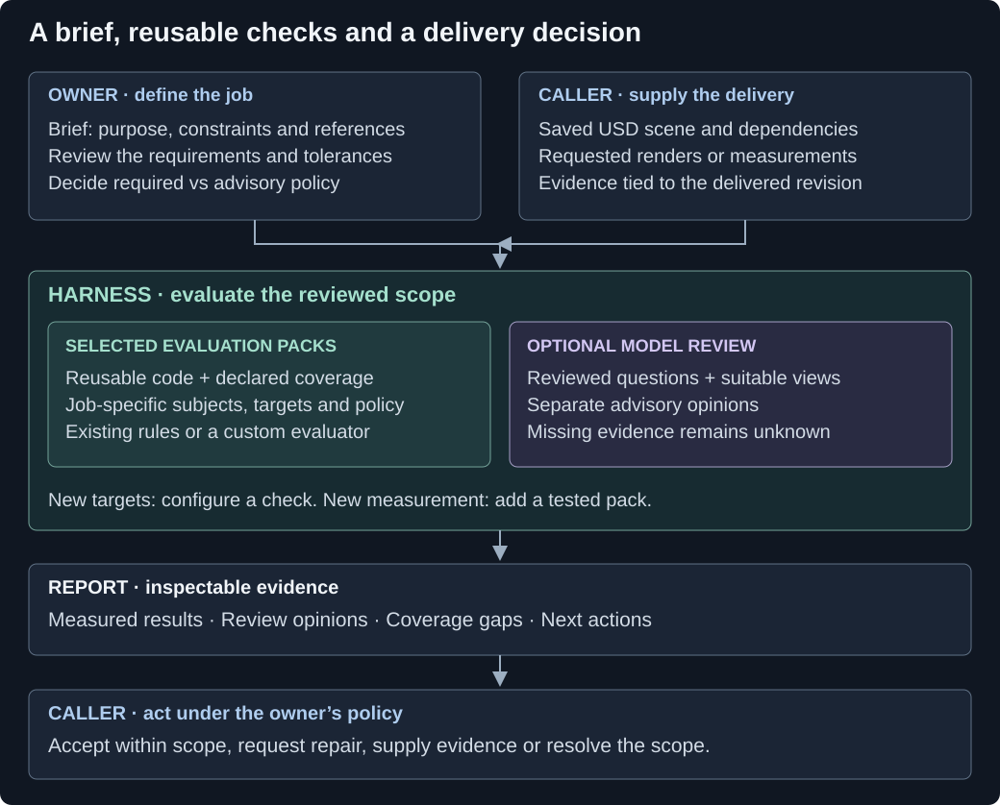

# Use the harness for your delivery

The harness manages acceptance of a particular saved OpenUSD delivery: which requirements apply, what evidence supports them, and what needs to happen next. Start with the intended use, select the checks that can support it, and keep unresolved requirements visible. The aim is inspectable evidence: a reader can trace a requirement to the observed result, see what supports it and identify decisions still needing review.



This diagram describes responsibilities. Preparation is optional when the caller already has a reviewed contract. The calling application owns rendering and the producer loop; the harness does not automatically build or repair scenes.

## Why check after giving the agent the brief?

The brief tells the producer what to build. The harness examines the saved delivery against the selected requirements and retains evidence of what passed, failed or remained unknown. The producer can use the same harness before handing over the result; the receiving application still owns the scope and release policy.

A brief asking for a 300 mm panel does not prove the delivered panel is 300 mm wide. A bounds check can measure that. A request for a readable label needs suitable rendered evidence and review. The harness keeps these different claims separate, binds them to the submitted revision and can repeat the checks after repair without silently changing the target.

A capable agent could implement equivalent checks and records itself. The reusable benefit here is the shared contract, tested evaluators, report format and evidence handling across jobs and applications. It does not guarantee independent judgment when the same model defines the scope and reviews the result. The experiments have not established a general reduction in time or repair attempts.

## Who owns each decision

| Role | Owns |
|---|---|
| Human or domain owner | Intended use, specification, references, tolerances and tradeoffs. Reviews the scope and decides which results are required, advisory or subject to human review. Owns the release policy. |
| Calling application or agent | Saves the scene, passes inputs, invokes preparation/evaluation, obtains authorized scope approval, supplies requested captures and records, and acts on the report. Can automate routine decisions under the owner's approved policy. |
| Harness | Checks supported inputs and scope identity, runs selected evaluators, and reports findings, coverage, missing evidence and an outcome for the supplied scope. Its optional interpreter proposes requirements; its optional judge provides evidence-limited opinions. |
| Producer | Builds and repairs the delivery against the agreed requirements, returning a saved revision. May run the same checks before delivery. |
| Pack maintainer | Implements or adapts a measurement, declares its inputs and limitations, tests it, and versions changes. Investigates incorrect evaluations. |

Scope approval confirms what will be evaluated. It does not approve the resulting scene. A reported `ACCEPT_FOR_USE` applies to the selected required checks and submitted revision; the receiving application still decides whether that scope is sufficient for release. A judge opinion cannot supply human approval or override a required script failure.

## What a brief means

A **brief** is the package describing the job: intended use, requested outcome, constraints and supporting references. It can contain a formal specification, but it may also contain context, examples and unanswered questions. A **specification** states explicit requirements. A **contract** selects checks and parameters. A **requirement map** links source requirements to checks, review questions and unresolved obligations. The caller reviews these before relying on them for acceptance.

For a manufacturing scene, a brief might include:

- Written purpose: an operator walkthrough, a layout review or a simulation study.
- A P&ID, floor layout, equipment list, relevant datasheet excerpts and reference photographs.
- Required equipment, dimensions, clearances, tags, motion sequences and delivery rules.
- Which sources are authoritative, which images are illustrative, and what needs clarification.

The raw-brief path accepts UTF-8 text, PNG/JPEG references and selected PDF pages or regions with original-document hashes and page/region provenance. There is no native CAD or semantic P&ID importer. A drawing can support interpretation and visual review; process connectivity still needs an explicit tag/port/connection mapping and appropriate domain review. Images do not establish hidden dimensions. See [PDF intake](EXTENSIONS.md#pdf-sources).

## Bring your own brief

The brief can combine job requirements with an existing delivery policy. Keep requirement IDs, original text/image references and units. A requirement needs a named subject, an applicable check or review method, and enough evidence to answer it. Adding a source document alone does not create test coverage.

| What you have | How to supply it | What still needs review |
|---|---|---|
| Known checks with exact targets | A [contract](PACKS_API.md#a-use-profile-is-a-contract-not-a-pack) selecting packs, parameters, prerequisites and required/advisory status | Whether the chosen checks and subjects cover the intended use |
| Source requirements already mapped to checks and review | A [mapped brief](BRIEFS_AND_MODEL_REVIEW.md#what-a-brief-package-contains) with source references, requirement IDs and coverage declarations | Mapping completeness, unsupported requirements and required approvals |
| Raw text and reference images | A raw-brief source manifest plus an explicitly configured interpreter through [preparation](PREPARATION_AND_SKILLS.md#invocation) | The proposed requirements, tolerances, mappings and capture plan before scope approval |
| A requirement beyond the existing measurements or evidence adapters | Retain it as unresolved, then add a tested evaluator/evidence adapter or obtain a separate specialist assessment | The new method's coverage and whether its evidence supports acceptance |

For a raw brief, the sequence is **prepare → review scope → supply requested evidence → evaluate → act on findings**. The approved map is retained for evaluation and ordinary repairs; a changed brief requires a new scope. The interpreter supports a bounded set of mappings and does not generate executable tests. A custom pack is not automatically available to raw-brief interpretation: select it explicitly in a contract or mapped brief, or extend and test the interpreter's mapping support.

For already structured inputs, these are alternative direct invocations. Each output directory must be new and outside the input bundle:

```sh
# A contract selects the checks and parameters. No model is required.
check-3d --bundle-root ./delivery --candidate scene.usda \
  --contract contract.json --out ./contract-report

# A mapped brief retains sources and requirement-to-check coverage.
check-3d --bundle-root ./delivery --candidate scene.usda \
  --brief briefs/brief.json --out ./brief-report
```

These commands expect the respective JSON formats and their declared inputs inside `delivery`. `--brief` does not accept an arbitrary prose file. For an application integration with preparation, approvals and evidence handoff, use the versioned [application protocol](APPLICATION_PROTOCOL.md).

## Extend the part your job needs

| Your need | Change | Example and boundary |
|---|---|---|
| A different target for an existing measurement | Contract parameters or a reviewed brief mapping | Change a dimension, motion sample time or polygon budget. The check's original coverage still applies. |
| A new repeatable measurement | A versioned evaluation pack | Check a new relationship between parts, or adapt a specialist validator. Test passing, failing, unsupported and missing-evidence cases. |
| A different qualitative question | Judge rubric and capture expectations | Ask whether a label is legible in a specified view. The caller supplies that view; the opinion stays advisory. |
| A new kind of evidence | An evidence adapter and checks for its validity | A new runtime trace or sensor output needs code to interpret it. A rubric change alone cannot teach the current judge adapter to validate physical behavior. |

Use the [pack API](PACKS_API.md#add-a-third-party-pack-without-changing-the-core) for numerical checks and the [preparation/customization guide](PREPARATION_AND_SKILLS.md#customization-shipped-in-the-wheel) for review questions, capture overrides and the two exportable adopter skills. A skill guides the calling agent; it does not become a scripted evaluator.

Where a SimReady profile fits the job, I would use its validation and runtime tests within this workflow through a suitable adapter. [SimReady Foundation](https://docs.omniverse.nvidia.com/simready/latest/simready-faq.html) supplies those facilities. The [caller-owned engine bridge](EXTENSIONS.md#engine-bridge-and-caller-evidence) can now run a configured CLI and import selected native results. Its transport controls are tested; actual SimReady/PhysX runtime validation still needs the target installation. The baseline NVIDIA adapter runs selected USD Validation rules.

## What makes an evaluation pack reusable

A **pack** owns measurement code, a parameter schema, its version and stated coverage. A **contract/profile** selects that code for a job and supplies subjects, targets and policy. Keep those responsibilities separate so a new assignment can reuse a tested measurement.

The [external mesh-budget example](../examples/studio-mesh-pack/README.md) counts faces on named static meshes. One application can require a tight per-mesh budget; another can use a larger budget or report the same measurement as advisory. They reuse the check while changing the contract. Face counts do not predict viewport frame rate.

An adopter can:

1. Reuse a suitable existing check, or implement a `CheckSpec` returning an `Outcome` with observed/expected evidence and coverage.
2. Package a `Pack` with declared implementation files and dependencies; register its factory through the `scene_acceptance.packs` entry point.
3. Test and version the pack, then install it in each application's harness environment. Installation alone does not enable it: the caller must explicitly allow an external pack.
4. Select it in reviewed contracts, pin its version, and map relevant requirement IDs when using brief/review coverage. Configure each delivery's subjects and targets.
5. Reuse the common JSON/HTML findings and coverage reports in the application's feedback loop. Review scope again when the evaluation policy changes.

Profiles are reviewed contract templates in this release; there is no remote pack marketplace, profile inheritance or automatic installation from a producer's delivery. Packs run trusted Python and do not expand the core reader's supported USD subset. Keep that boundary in mind when a new use requires different composition features, larger scenes or a different simulator.

## Assumptions and risk: supported today and planned

The [declared-scope review](DECLARED_SCOPE_REVIEW.md) can record a caller-listed inferred necessity or a producer decision containing alternatives, assumptions and supporting evidence. It can require a separate review before declared-scope acceptance. These records must be supplied and mapped; an ordinary scene check does not discover every assumption the producer made.

| Area | Supported today | Extension I want to develop |
|---|---|---|
| Missing or ambiguous requirements | Preparation can propose unresolved/unsupported items; caller review remains necessary | Stronger checks for omissions and conflicts across multiple source documents |
| Producer assumptions | Declared decision records include assumption strings, alternatives, affected paths and evidence | Individual assumption IDs with typed basis and source/requirement links |
| Inferred requirements | Caller-listed inferences retain proposed/approved status and require an authorized basis. Experimental [audit](EXTENSIONS.md#assumption-audit) can propose cited questions about undeclared choices. | Independent evaluation of missed questions and false concerns; questions do not become findings or approved scope automatically |
| Consequence and escalation | Optional [AI triage](ASSUMPTION_TRIAGE.md) recommends routine handling, human review or more context for selected assessed items; deterministic caller policy preserves mandatory gates | Domain-specific consequence categories and independent evaluation of missed concerns and unnecessary escalations |
| Specialist engineering evidence | Explicit process tag/port connectivity, scoped geometry/motion checks and imported engine evidence; the incline example remains available | Target-engine reference controls, domain-specific packs and semantic P&ID extraction |

The [triage guide](ASSUMPTION_TRIAGE.md) documents the implemented CLI/library operation and a runnable synthetic example. The [enhancement plan](ASSUMPTION_REVIEW_PLAN.md) defines the remaining development work and how to assess its value. A useful audit question should say what appears assumed, where it came from, which requirement or object it affects, what consequence is plausible, and who must resolve it. The owner or domain specialist must define what makes that consequence significant; model confidence is not a measure of engineering risk.

For example, a pump chosen from a reference picture may have a plausible shape but an unknown duty point. Today, a caller can declare that decision and require evidence/review; the harness does not infer the pump's suitability from its appearance. An owner could make missing duty-point evidence block acceptance for a simulation study while treating it differently for an illustrative layout. This is an illustrative policy example, not a tested automatic risk-detection result.

## Make review a release gate

The point of this workflow is to make trust in a delivery depend on inspectable evidence. A repeatable governance process needs the receiving application to enforce these steps:

1. Agree the intended use, requirements and review policy before judging the delivery. Retain unresolved items instead of inventing approval.
2. Evaluate the saved revision and retain findings, coverage and evidence. Include producer decisions and assumptions that the review plan requires.
3. Route open work to its owner: the producer repairs, the caller supplies evidence, and the domain owner resolves consequential assumptions or disputed requirements.
4. Require the scoped result and any required approvals before release. Re-evaluate a repair; changed evidence or policy must not reuse an inapplicable approval.

For a caller-declared required decision obligation, missing decision evidence or a required review prevents declared-scope acceptance. That is an enforceable review point when the application uses the result as a release gate. The standalone harness cannot stop an application that ignores its report, and it cannot require review of an assumption absent from its scope. Optional triage helps route declared items under caller policy; experimental audit proposes questions for review, while richer individual assumption records and validated discovery quality remain unfinished.

This structure makes the basis for a decision visible and repeatable. It still depends on a relevant requirement map, honest evidence and competent review. It does not turn the producer's explanation or a model's opinion into verified engineering fact.

## Read the report as work to do

Keep measurements, model opinions and gaps separate. A failed required dimension calls for repair. Missing views call for evidence. A disputed requirement calls for scope review. A broken provider calls for an environment or evaluator fix. The [application protocol](APPLICATION_PROTOCOL.md) describes the structured next actions; the [reporting guide](REPORTING.md) explains subjects and coverage counts.

The useful result is a record of what was established for this delivery and what remains open. The owner decides whether that is enough for the intended use.
