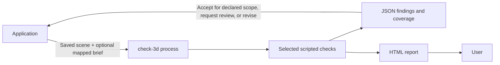

# Call the harness from an application

For new integrations, use the versioned [application protocol](APPLICATION_PROTOCOL.md): consistent JSON envelopes, preparation/approval/rebinding, evidence preflight, progress, cancellation and verified replay. The examples below retain the earlier direct CLI interface.

The primary integration is a local executable: the application launches `check-3d` with a saved scene and optional brief, then reads its structured result. The application can be written in Python, JavaScript, C#, C++, or another language with process-launch and filesystem access. No HTTP endpoint is required for this workflow.

This interface is included in release 0.5.0. The supported input is a bounded USD bundle with local dependencies. An application using another representation must first produce a supported export. Calling the executable does not give it access to an application's unsaved in-memory scene. A browser-only frontend needs its backend or desktop host to launch the process.



## One executable, optional brief

```sh
# General checks only.
check-3d --bundle-root /data/delivery --candidate scene.usda \
  --out /data/reports/run-001

# Same general checks plus mapped text/image requirements.
check-3d --bundle-root /data/delivery --candidate scene.usda \
  --brief briefs/brief.json --out /data/reports/run-002
```

Use a configured installed executable, preferably pinned in the application's environment. Supply arguments as an array, not a shell command assembled from filenames. Capture stdout and stderr separately. The process is synchronous; a GUI should run it in a background task to keep the interface responsive. No production agent or model is called by these checks.

Each call needs a new output directory outside the bundle and its ancestors. The scene, optional text/images and brief manifest are inside the bundle; the manifest refers to them with bundle-relative paths. The app owns saving the scene, mapping/approving requirements, deadlines, run history and any revision loop. The harness owns admission, selected checks, evidence and report generation. A failed run must not silently select another scope.

The [brief guide](BRIEFS_AND_MODEL_REVIEW.md) explains the prepared JSON manifest. Arbitrary prose and images do not become complete tests automatically. A human, application or agent prepares an explicit map and keeps unresolved scope visible.

## Read results, including rejected scenes

The current CLI writes a compact JSON summary to stdout when it finishes a report. Its fields differ by mode; this is not yet a single versioned invocation-response schema. Detailed machine-readable evidence lives in the report directory.

| Mode | Stdout fields | Full evidence relative to `--out` |
|---|---|---|
| General/profile/contract | `verdict`, `complete`, `report` | `result.json`, `overview.json`, `manifest.json`, `report.html` |
| Brief | `core_verdict`, `assessment_verdict`, `report` | `report/core-result.json`, `report/assessment.json`, `report/brief-context.json`, `report/report.html` |
| Brief with scene-admission failure | Same brief summary fields, if a diagnostic report was produced | `report/result.json` and source/coverage files; no fabricated full assessment |

| Process exit | Meaning |
|---|---|
| 0 | Required selected checks or declared-scope obligations accepted |
| 2 with a valid `REJECT` report | A required check/obligation failed |
| 2 without a valid result | Command usage error, such as an invalid or empty argument |
| 3 | Insufficient evidence or further review needed |
| 4 | Evaluation or report-generation error; inspect the result if present and diagnostics otherwise |

Nonzero does not always mean the command failed to run. A rejection is a useful completed assessment. Read the JSON/report and check its relationship to the exit code. Missing, malformed or contradictory output is an invocation failure, never an acceptance. `complete` concerns the selected contract's results, not all possible scene properties.

Use the artifact verdict for general scene diagnostics and the declared-scope verdict for a supplied brief. Keep general checks, mapped requirements and uncovered intent separate in the application UI. Use per-check subject units/counts from `overview.json` and the detailed result; do not add incompatible counts into one quality percentage. The HTML report exposes source text/images, observations and unknowns for the user.

## Runnable host examples

The [Python example](../examples/application-integration/python_app.py) exports `check_scene(request)`. The [Node example](../examples/application-integration/node_app.mjs) exports `checkScene(request)`. Both launch the installed CLI, capture separate streams and load the report. Their returned object is an example application's convenience format, not a new harness protocol.

Example host request file:

```json
{
  "harness": "/absolute/path/to/venv/bin/check-3d",
  "bundle_root": "/data/delivery",
  "candidate": "scene.usda",
  "brief": "briefs/brief.json",
  "out": "/data/reports/run-003",
  "timeout_seconds": 120
}
```

Omit `brief`, or set it to `null`, for general checks. An empty string remains an invalid brief argument. These examples handle the two primary modes; advanced contract/review-plan integrations should preserve their existing CLI options and source-approval boundaries explicitly.

```sh
python examples/application-integration/python_app.py /path/to/request.json
node examples/application-integration/node_app.mjs /path/to/another-request.json
```

Give each example invocation a distinct `out` directory. `status: reported` means the example read a report consistent with the process outcome; inspect `artifact_verdict` and `declared_scope_verdict` for acceptance. `status: invocation_error` means it could not obtain a consistent result. Examples return a timeout/process error rather than inventing a scene verdict. They are synchronous demonstrations, not a production process supervisor; a production host owns resource limits and descendant-process cleanup.

## Optional model analysis and future work

The [unified invocation](EVALUATION_MODES.md) now implements explicit `checks`, `judge` and `both` modes, an optional brief in every mode, a versioned result envelope and no-brief advisory review. The Python/Node host examples accept optional `mode`, `judge_config`, `views`, `rubric` and `judge_exposure` fields and validate the unified result separately. Omitting `mode` retains all legacy examples and layouts above.

An application can separately invoke `check-3d-judge --report … --config … --out …` with its configured model CLI. The existing reviewer requires a brief report and explicitly supplied evidence/views. It is optional, has its own output and never changes a script result. A GUI can show measured findings and advisory opinions in separate sections.

A versioned `evaluation.json`, `--capabilities`, and `--list-tests` are available with the new invocation. A unified batch interface accepting per-scene briefs remains future work. The [HTTP proposal](HTTP_API_PROPOSAL.md) is an optional future wrapper for remote execution; no HTTP service exists.
