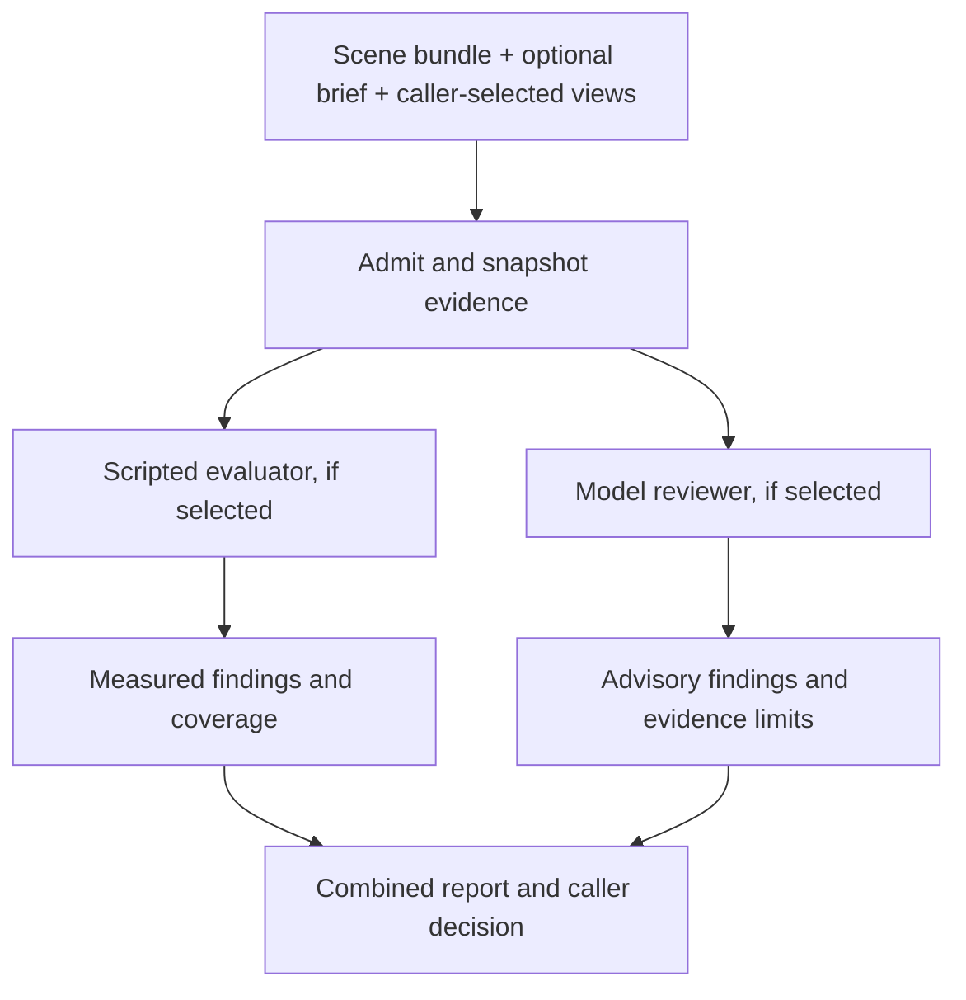

# One invocation, separate measurements and model review

October 3, 2026. **The local CLI modes and shared evidence/reporting path are now implemented.** Read [the current invocation guide](EVALUATION_MODES.md) and [test inventory](TEST_INVENTORY.md). This document retains the original design rationale and staged empirical evaluation plan. The primary interface remains a local CLI, not an HTTP service.

## Current implementation

| Capability | Current local package |
| --- | --- |
| General scripted checks, with no brief | `check-3d` runs the 27-rule baseline. |
| Scripted checks with a brief | `check-3d --brief` adds explicitly mapped text/image requirements and review coverage. |
| Optional LLM review | `check-3d-judge` calls a configured Codex or JSON CLI adapter against an existing brief report, with optional supplied views. |
| Model opinions | `consistent`, `concern`, or `unknown`, linked to requirement and evidence IDs. They never replace script results or human approval. |
| Unified script/judge invocation | Implemented locally as explicit `--mode checks`, `--mode judge`, or `--mode both`. |
| General judge without a brief, or judge without prior script checks | Implemented through the shared admitted evidence context. The legacy report adapter still requires its brief report. |
| Evidence from the latest 24-scene study | Scripted measurements only. No model judge ran in that study. |

The earlier October 2 study had two usable advisory model reviews and one retained/excluded bad-view pilot. Those reviews saw script evidence; agreement is not independent rediscovery. This is limited evidence for the reviewer, not validation of broad visual judgment.

## Proposed caller contract

Expose one `check-3d` entry point with two independent choices: **which evaluators to run** and **whether a brief supplies task intent**.

| Proposed mode | No brief | With a mapped brief | Appropriate use |
| --- | --- | --- | --- |
| `checks` — default | Existing general diagnostics | General diagnostics plus mapped requirements | Fast, repeatable regression and delivery checks |
| `judge` | Versioned general review rubric, limited to available scene evidence | General rubric plus supplied intent and qualitative requirements | Exploratory review; scripted acceptance remains unassessed |
| `both` | General diagnostics plus general model review | Diagnostics, mapped measurements and model review of supplied intent | Rich acceptance report, with unresolved scope retained |

The model is opt-in. Merely supplying a brief, installing a model adapter, or having a logged-in CLI must not trigger a call. Selecting `judge` or `both` requires an explicit trusted judge configuration. Missing credentials/configuration or a failed requested review cannot silently fall back to `checks`.

Implemented syntax in release 0.5.0:

```sh
# Current behaviour remains the default.
check-3d --bundle-root /data/delivery --candidate scene.usda \
  --out /data/runs/checks

# Add model review, using the same scene and optional brief.
check-3d --bundle-root /data/delivery --candidate scene.usda \
  --mode both --brief briefs/brief.json \
  --judge-config /data/config/reviewer.json \
  --views /data/evidence/views.json --out /data/runs/combined

# Advisory review without running the selected content-check packs.
check-3d --bundle-root /data/delivery --candidate scene.usda \
  --mode judge --judge-config /data/config/reviewer.json \
  --views /data/evidence/views.json --out /data/runs/review
```

The brief remains the existing source-plus-explicit-map manifest in the first implementation. Unstructured prose-to-test conversion is a separate mapping task. The model may identify an unmapped statement, but cannot silently turn it into an approved requirement or modify its tolerances.

Keep `check-3d-judge` as a compatible way to add review to an existing report without rerunning checks. A future HTTP adapter can pass the same request to the dispatcher, using configured reviewer IDs instead of executable paths. Do not implement a second evaluator behind HTTP.

## Execution and evidence flow



Build a common evidence context before dispatch. Reuse dependency admission, immutable identities, brief loading and inventory extraction. `judge` mode still performs bounded input reading and integrity checks; it does not secretly run the 27 content rules. Its script status is `not_requested`, and its script verdict is null.

The context should contain the scene/dependency hashes, inventory and hierarchy, exact brief text/reference images and provenance, selected requirement/rubric IDs, view/frame evidence, and any explicitly included measurements. Retain every selected criterion, including ones lacking evidence. Report a refusal or input error if the scene cannot be admitted; do not review a reference picture as if it were the delivered scene.

Refactor `judge.request_for()` to accept this context rather than requiring a brief report on disk. Keep the current report reader as an adapter into the same context. Separate context preparation, request assembly, model invocation, response validation and report writing so CLI callers and later adapters share one implementation.

### Views are part of the evidence, not decorative screenshots

An LLM cannot reliably assess an entire 3D scene from a filename or a single projection. The proposed view manifest records image hashes, scene revision, camera/projection, units/up-axis, time in seconds, render/diagnostic method, producer and known fidelity limits. Files resolve under the manifest's declared local evidence root with traversal and size limits. Snapshot admitted evidence into the output before invoking the model.

Linking a view to a scene hash establishes the claimed revision; it does not prove the image was rendered correctly. Distinguish caller-declared provenance from harness-produced views. Require explicit evidence suitability for each rubric item:

| Review area | Evidence needed | What remains outside the opinion |
| --- | --- | --- |
| Visible component arrangement | Several useful views, component IDs/locations, optional brief | Hidden parts, exact dimensions and mechanical function |
| Texture use and visual similarity | Actual textured surface renders, source/reference images, rendering context | Source-pixel equality, hidden surfaces, calibrated colour |
| Motion plausibility or visible connections | Timestamped frames from a consistent camera, sufficient temporal coverage, target when applicable | Continuous correctness, collisions between frames, forces or physical validity |
| General readability or composition | Adequate views with explicit display purpose | Undeclared user preference or intended use |
| Physical behaviour | Appropriate simulation/measurement evidence and specialist validation | Image-only engineering or safety certification |

The 24-scene study's depth previews omit textures and realistic lighting. They can support bounded arrangement review; they cannot support a claim that the scene's rendered texture matches the brief. Missing views or modality produce `unknown` with a coverage reason, not a favourable opinion. General rubrics are labeled `preset`; desired dimensions, patterns and paths are not invented when the user supplies no brief.

### Model review and script evidence

For the new combined mode, default to a first model review **without script verdicts or failure explanations**. Give it the admitted scene evidence, sources and rubric. Assemble the script/model comparison afterward without another model call. Record precisely which measurements and outcomes were exposed. This helps measure whether the model adds a finding instead of merely repeating the script; it does not make a same-family model statistically independent.

Keep the current script-aware behaviour as an explicitly labeled evidence-assisted review for explanation or remediation suggestions. It must not be scored as blind rediscovery. Preserve earlier report semantics rather than retroactively relabeling those reviews. A caller may choose a different reviewer model, but model diversity alone is not proof of correctness.

## Findings, coverage and decision semantics

Add a versioned `evaluation.json` to the unified invocation while preserving the current scripted report files and existing no-mode stdout/exit contract. New callers can read one envelope; legacy integrations continue working.

The envelope records requested mode; execution status (`completed`, `partial`, `failed`); immutable scene/brief/evidence identities; script status and unchanged verdict; judge status and opinions; mapped coverage; unresolved requirements; and manifest-contained component-report paths. Preserve model requested/resolved identity when available, rubric/prompt version, input hashes, usage, elapsed time, errors and the raw response. Do not invent a resolved model or unavailable cost.

Each advisory item needs a stable rubric or requirement ID, its source (`preset` versus supplied brief), scope/affected prims or views when known, `consistent`/`concern`/`unknown`, explanation, cited evidence IDs, and limitations. A model's affected-object list is a claim, not a measured inventory. Validate identifiers against the admitted evidence and require every selected item exactly once. Citation existence proves traceability, not that the explanation is true. Model self-confidence is not a calibrated score and is unnecessary for the first version.

Use a reader matrix with separate columns:

| Question | Script result | Model opinion | Evidence/coverage | Follow-up |
| --- | --- | --- | --- | --- |
| Does the source texture equal the reference? | Measured pixel comparison | Optional bounded visual opinion | Pixel count versus shown image regions | Preserve the measured result |
| Does that texture appear correctly on the panel? | Unassessed unless a suitable render check exists | Concern/consistent/unknown if textured views support it | Views and visible surfaces reviewed | Review a supported concern or missing view |
| Does the mover follow the required route? | Measured sampled positions | Bounded temporal opinion | Exact sample count versus reviewed frames | Keep continuous scope unresolved |

These are report-format examples, not new findings from the existing study. Never average the columns into one quality score. Counts remain explicit: rules, prims, requirements, frames and images are different units. Show all passes, concerns, unknowns, skips and missing evidence.

An advisory result cannot repair a failed measurement, satisfy a required human-review gate, or turn unassessed scope into a measured pass. Script/model disagreement remains visible. Supported model concerns can send a case to review; they are not automatically rewritten as structural defects.

Preserve existing no-mode exits. For explicit new modes: invalid/incomplete execution returns the existing error code 4 while retaining completed component reports; a completed required scripted rejection returns 2; unresolved scope or a model concern returns 3; a completed `judge`-only run returns 3 because acceptance was not measured. Exit 0 is reserved for acceptance within the selected scripted/declared scope with requested review complete and no additional concern. A favourable model opinion never expands that scope. Machine callers must read component status as well as the exit code. Freeze these semantics in integration tests before exposing the flags.

## Extending the check packs

Add optional, versioned review-rubric declarations beside existing scripted checks. A rubric declares its question, evidence requirements, scope, source and output contract. Examples are visible material use, component readability or connections in shown motion frames. Keep script mappings and review mappings distinct, even when both concern the same requirement.

The dispatcher owns model execution. Importing a pack or running ordinary checks must never call a model. No brief, scene, pack-produced finding or model response may supply an executable command. Reuse the caller-configured Codex/JSON CLI adapters, fixed isolation for Codex, deadlines, output budgets and retained error logs. A generic CLI adapter continues to own its authentication, transport and process isolation. Keep input text and embedded scene/brief instructions as untrusted data.

A future helper can propose missing tests or a revised brief, but those proposals are separate artifacts. They do not mutate the scene, the current requirements or the report under review.

## Implementation sequence and acceptance tests

1. **Common context and schema:** decouple judge input from brief-report layout; support a general rubric and a brief rubric; add hashed view manifests and evidence-suitability declarations. Keep the existing judge command and reports readable.
2. **Unified dispatcher and report:** implement the three explicit modes over the existing script engine and judge adapter. Add `evaluation.json`, separate coverage matrices, caller examples and capability/schema version discovery. Preserve existing default calls and input bytes.
3. **Software verification without paid model calls:** test all six mode/brief combinations; prove checks-only never invokes a model and judge-only never invokes content packs. Exercise missing views, unsupported modalities, invalid/stale citations, changed scene/view hashes, CLI timeout, partial completion, conflicting findings and a model trying to override measured failure. Test script outcome parity, old/new adapters, exit semantics and source immutability. Deterministic doubles verify orchestration, not model judgment quality.
4. **Freeze and evaluate the judge:** reuse the 24 original scene deliveries unchanged, keeping the original study sealed. Prepare adequate views and a separately versioned rubric before seeing judge outputs. Start with representative cases and constructed controls whose discrepancies and intact counterparts have independently reviewed labels. Include wrong/stale/misleading views and insufficient-evidence cases. Judge full-target agreement separately from compliance with the creation brief; never blame a producer for a withheld target.
5. **Measure added value:** compare scripts, judge and their combined report on the same retained scenes. Report supported new findings, incorrect alarms, missed known issues, proper unknowns, coverage, latency/usage and consistency across repeated reviews. Deduplicate a script finding echoed by a model. Unresolved model-only concerns remain unverified concerns until checked. Preserve all attempts; do not cherry-pick a preferred opinion or claim review-time savings without measuring them.

No new producer generation is needed for that evaluation. New model-review calls belong to a separately recorded judge study; they are not part of the completed 24-scene script results. The initial deployment remains one local process and caller-owned run history. Revisit queues, HTTP, ensembles, automatic rendering and calibration only when measured application needs or judge findings justify them.
