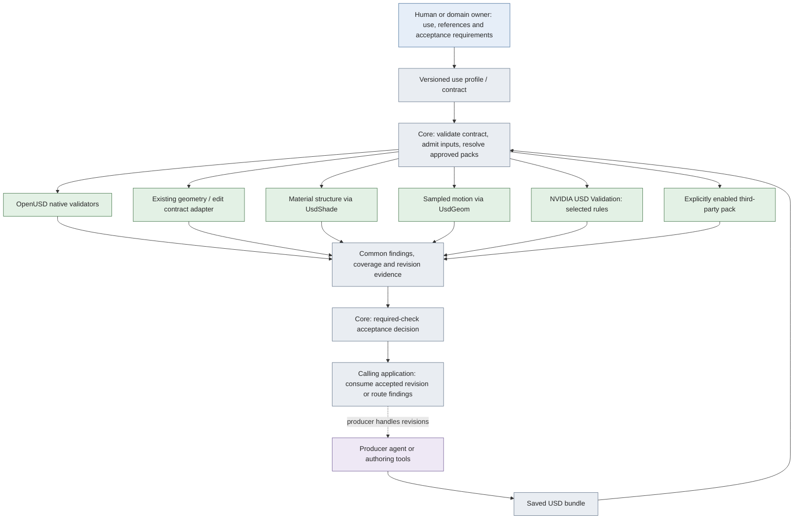

# Evaluation packs: extension API 1.0 / harness 0.5.0

For the responsibilities and extension choices behind this API, start with the [adopter guide](ACCEPTANCE_WORKFLOW.md). It explains how your specification selects reusable checks, when a new pack is needed and what the owner or calling application still supplies.

One application-owned contract selects checks from installed packs. A pack supplies measurements and findings. The core records coverage, prerequisites, versions and input identity, then reduces the required results. It never repairs a scene. The calling application routes feedback and decides whether to ask its producer for another candidate.

The same distribution includes the explicitly selected [four-job supplemental preset](SUPPLEMENTAL_CHECKS.md) and [declared-scope review](DECLARED_SCOPE_REVIEW.md). Add a measurement as a `Pack`/`CheckSpec`; add its intended-use obligation and evidence mapping to the caller's review plan. These are separate extension points. A passing measurement does not automatically approve the mapping or fill an absent requirement.

## Implemented architecture



Legend: blue = human responsibility; purple = producer agent; gray = application/core code; green = evaluation packs and upstream tools. The evaluator runs selected checks sequentially in prerequisite order. Independent checks continue after a provider error. This implementation has no automatic producer loop or repair function. The optional bounded incline worker is explicitly selected by a contract; the batch runner can schedule at most two independent local evaluations.

## Packs available in this version

| Pack | Selected checks | Evidence boundary |
|---|---|---|
| `openusd` 1.1.0 | Named `UsdValidation` validators; warning policy is explicit | Native provider-specific scope. Available validators include geometry, shading and physics schema checks; they are not all enabled or individually certified by this project. |
| `geometry` 1.0.0 | Existing contract v1 through the compatibility evaluator | Current cube/polygon/edit rules and their original coverage limits. A nested contract must be declared as evidence and cannot add undeclared dependencies. |
| `materials` 1.2.0 | Named resolved bindings, expected surface shader IDs and dependencies connected to selected materials | Does not decode textures, validate UV mapping or render/reference appearance. A material shader says nothing about measured friction. |
| `motion` 1.1.0 | World transform origin at specified time codes, in meters | Does not prove orientation, collision, continuous motion or physical feasibility. Time codes are not implicitly seconds. |
| `motion.timing` 1.1.0 | Authored stage duration, optional exact rate, and world origins at elapsed seconds from stage start | Requires an explicit valid clock/range. Does not infer active motion duration or prove a continuous path. See [timing requirements](MOTION_TIMING.md). |
| `nvidia.asset-validator` 1.1.0 | Named rules from `usd-validation-nvidia==1.20.0`; optional dependency | Reports upstream rule and severity. Does not call fixers, stamp an asset or claim SimReady profile/task acceptance. |
| `textures.decode` 0.2.0 | Verify and fully decode a selected PNG/JPEG | No expected-image, UV or render acceptance. |
| `motion.connection` 0.1.0 | Sample the gap between two named local points | No continuous-time or collision proof. |
| `physics.incline-worker` 0.2.0 | Execute the fixed incline model and validate the matching trajectory | No general physics importer or measured calibration. |
| `scene.audit` 1.1.0 | Discover file availability, image readability and finite authored transform samples | Generic diagnostic scope; no inferred task requirements. |
| `studio.mesh-budget` 0.1.0 | Independently installed example: named static mesh polygon budgets | Consumer policy example; does not establish topology validity or rendering performance. |

Native/NVIDIA catalog size measures discoverability, not tested coverage. Use the catalog command to inspect the exact installed versions and names. Unsupported or unavailable requirements cannot become silent passes.

## Install and inspect

Use a fresh Python 3.12 environment. From the project folder:

```sh
python3.12 -m venv .venv
.venv/bin/python -m pip install .
.venv/bin/check-3d-packs
.venv/bin/check-3d-packs --upstream openusd
```

For the optional NVIDIA adapter:

```sh
.venv/bin/python -m pip install '.[nvidia]'
.venv/bin/check-3d-packs --upstream nvidia
```

The base install only requires OpenUSD and JSON Schema. Listing the default pack catalog reports a missing optional dependency without failing unrelated profiles. Required use of an unavailable dependency returns an evaluation error.

## A use profile is a contract, not a pack

`contract-v2.schema.json` defines the format. A profile has an ID and version, with its requirements embedded in the contract. The package does not implement profile inheritance, a remote catalog or profile includes. Reuse a reviewed contract template and pin its hash in the calling application when needed.

Each check instance has a unique ID, pack ID, check name, required/advisory flag, strict parameters and optional `after` prerequisites. This permits the same measurement under different tolerances or consumers. Pack versions must match exactly; an optional `sha256` pins the descriptor, declared source hashes and dependency identities. Repeated checks still retain individual findings. No averaged quality score can hide a required failure.

Historical contracts retain their original pins. The current evaluator requires matching versions; use an explicit upgrade proposal in a copied bundle and review its changes. This does not approve changed requirements or replace an implementation digest pin.

See the complete [combined profile](../evaluation/packs-v1/fixtures/combined_profile/contract.json). It selects material, motion, native, NVIDIA and third-party budget checks for the same artifact.

```sh
.venv/bin/python -m pip install ./examples/studio-mesh-pack
.venv/bin/python -m scene_acceptance.contract_upgrade \
  --bundle-root evaluation/packs-v1/fixtures/combined_profile --out /tmp/combined-input-01
.venv/bin/check-3d --contract contract.json --candidate scene.usda \
  --bundle-root /tmp/combined-input-01 \
  --allow-pack studio.mesh-budget --out /tmp/my-scene-review
```

The output directory must be new and outside the input bundle. The JSON and HTML reports retain individual findings and pack summaries. An accepted geometry-only profile is not acceptance for a different material or motion requirement.

## Add a third-party pack without changing the core

The complete [example package](../examples/studio-mesh-pack/studio_mesh_pack.py) has its own `pyproject.toml` and uses a Python packaging entry point:

```toml
[project.entry-points."scene_acceptance.packs"]
"studio.mesh-budget" = "studio_mesh_pack:get_pack"
```

The factory returns `Pack(id, version, description, checks, source_files, dependencies)`. A `CheckSpec` declares the function, JSON parameter schema, description, coverage and limitations. Its function receives a `Context` and a private copy of its parameters and returns `Outcome(status, reason, evidence)`.

- `Context.artifact.stage` is the admitted OpenUSD stage. `baseline` is optional.
- `Context.bundle.record(path)` records a local input and its initial digest; changed inputs cannot be re-recorded to erase the change.
- `Context.sources` lists declared reference files. Missing required evidence should raise `MissingEvidence` or return `UNKNOWN`.
- Evidence should identify the object/property, observed and expected values, units, time/sample where relevant, and the measurement's coverage. Provider-specific data remain inside the common evidence record.
- Declare every implementation file and relevant dependency. The core fingerprints the descriptor and declared source files and records installed dependency versions/RECORD identity. This is provenance for trusted code, not cryptographic proof of every transitive runtime dependency.
- Use `PASS`, `FAIL`, `UNKNOWN` or `ERROR`. A required `NOT_APPLICABLE` is an evaluation error. A pack cannot override the caller's required flag or the overall decision.

Discovery reads entry-point metadata without importing third-party code. Installation alone does not enable a pack. Pass `--allow-pack` or explicitly register a trusted `Pack` in the Python API. Duplicate pack IDs, mismatched entry-point IDs, invalid parameter schemas and incompatible API versions are rejected. Candidate contracts name approved packs; they cannot supply module paths or installation commands.

The plugin and its dependencies are trusted installed code. In-process functions have no security isolation or enforced wall-clock timeout. They must not mutate submitted files or USD layers; the core checks file, in-memory layer and declared pack identity changes and invalidates affected runs. These checks are not a sandbox against hostile Python. Put expensive/untrusted evaluators in a caller-managed process/container with read-only input mounts before using such providers. The [supervised native worker](EXTENSIONS.md#supervised-native-execution) is available for bounded execution; a general worker scheduler remains future work.

## Verdict and dependency behavior

A required failure yields `REJECT`; required unknowns or errors remain visible even when a known failure already rejects the artifact. Without a required failure, an error yields `EVALUATION_ERROR`, an unknown yields `INSUFFICIENT_EVIDENCE`, and all required passes yield `ACCEPT_FOR_USE`. Input/contract/integrity errors always invalidate the run. Advisory findings are visible but do not gate acceptance. A failed prerequisite leaves dependent checks `UNKNOWN` rather than pretending they ran.

## Admission and limits

The `usd-local-v1` contract format now uses the bounded local reader v2. It admits local references, sublayers, selected variants, loaded payloads, inherits, specializes and instance proxies; all authored dependency branches are checked before composition. Explicit local `<UDIM>` filenames expand tiles 1001–1999 under the same file budget. Limits remain 32 MiB per file, a caller-configurable dependency budget (default 64), a caller-configurable composed-prim budget (default 10,000, maximum 250,000) including instance proxies and 10,000 samples per asset attribute. URLs, packages, value clips, cycles and dynamic formats remain unsupported. [Layer policy and dependency cross-checks](EXTENSIONS.md) are separate selected checks; successful admission is not acceptance.

The CLI `--max-dependency-files N` and API `evaluate(..., max_dependency_files=N)` accept integers from 1 to 1024. This is caller-owned resource configuration, not a contract field or producer-selectable acceptance threshold. The effective value is recorded in `runtime.admission_limits.max_dependency_files`. Candidate and baseline closures are counted separately; each count includes its root and unique dependent layers/assets, including missing declared assets. The v1 static evaluator and the v2 geometry compatibility adapter also honor the caller's file budget.

A file-budget overrun yields a required `UNKNOWN` coverage record containing `kind: resource_limit`, `limit_name`, `limit` and `observed_at_least`; selected checks that did not run remain `UNKNOWN`. The overall result is `INSUFFICIENT_EVIDENCE`, CLI exit 3. Earlier immutable reports may show this condition as `EVALUATION_ERROR`. All path, type, composition, integrity, per-file-size and prim-count controls remain active. Larger budgets increase possible resource use; the caller still provides process memory/time isolation.

Old contract v1 still dispatches to the static compatibility evaluator. Old records remain immutable; the current development package identifies checker 0.7.0.dev9. The GitHub v0.3.0 release retains its original implementation and separate content/physics experiments. See [the evidence guide](EVIDENCE.md) for the boundaries between them.

## What to add next

A new pack is appropriate when it adds a distinct measurement or source of evidence: renderer/reference comparisons, runtime contact tests, sensor/label alignment or observed-data consistency. Reuse upstream validators rather than reproducing them. A profile selects the subset relevant to its use; it should not enable every available check merely to make the report look comprehensive.

The SimReady validator is publicly discoverable in the package index inspected for this work. Integrating its approved profile definitions and runtime benchmarks remains separate work; an asset rule adapter alone does not establish SimReady profile conformance. Physics simulation needs a named engine, version, reset/timestep/seed policy, runtime evidence and a justified reference. The core pack evaluation did not run a renderer or simulator. The restricted CPU MuJoCo follow-up is now exposed as the explicitly selected `physics.incline-worker` pack in release 0.5.0. No robot training or hardware run is included.

## Coverage reports and baseline

See [REPORTING.md](REPORTING.md) for count definitions, provider coverage, the caller-selected baseline, generated contracts and portable report formats. Per-check assessments do not alter the original contract reducer. The historical release remains unchanged.

## Optional prerequisite declarations

`CheckSpec` accepts additive `capabilities` metadata and a `preflight(context, parameters)` callback returning a list of subject/reason gaps. The callback must be read-only and bounded. Parameter validation happens before invocation; preparation retains the result with scene identity. Legacy packs remain usable and report unavailable preflight. A ready prerequisite check is never a content PASS. Bump pack versions when measurement semantics change and include helper modules in `source_files`.
