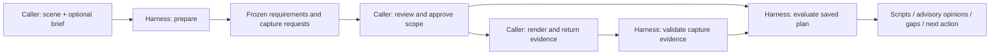

# Prepare, capture and evaluate

Start with the [adopter guide](ACCEPTANCE_WORKFLOW.md#bring-your-own-brief) to choose between an existing structured specification and raw text/image preparation, and to see who owns each decision.

Release 0.5.0 includes a harness-owned raw-brief interpreter and a caller-owned capture handoff. It remains a CLI/library, with no hosted service or renderer. The existing direct `check-3d` interface is unchanged.

| Stage | Caller/application provides | Harness does | Saved result |
|---|---|---|---|
| Prepare without brief | Saved USD bundle, optional versioned rubric and capture capabilities | Admits scene, inventories it and requests general visual evidence; zero model calls | Scene snapshot, rubric, capture plan and plan hash |
| Prepare with brief | Same scene, raw text/image source manifest, explicit interpreter CLI | Proposes requirements, selects supported numerical checks, identifies visual questions and retains unresolved/unsupported scope | Source quotes, mapped brief with pending review, interpretation, capture requests and frozen identity |
| Review and approve scope | Caller review of the proposed map, expected scope hash, reviewer and reason | Records the authorized scope decision separately from the frozen plan | Scope approval record; no approval of the scene outcome |
| Capture | Its own renderer/compute, requested angles, targets, times and fidelity | Provides instructions and a receipt template; no rendering or GPU allocation | Caller view manifest plus request-to-view receipt |
| Validate evidence | Frozen preparation and paired view manifest/receipt | Checks requested capture bindings, metadata and eligible evidence; no model call | Supplied/missing/invalid evidence matrix |
| Run checks | Frozen preparation path/hash | Runs general baseline and mapped scripts without another interpretation call | Check outcomes, measured subjects and requirement gaps |
| Run judge or both | Frozen preparation, explicit judge CLI, optional paired views/receipt | Validates captures, limits suitable evidence to fulfilled requests, runs selected evaluators | Advisory findings, measured outcomes, missing-evidence table and linked component reports |



The interpreter uses scene information to identify objects and frame captures. Desired dimensions, tolerances and sample times must come from the supplied brief. It must not derive an acceptance target from the delivered geometry. The validator checks schema, allowed check types, source quotes, IDs and capture bindings; it cannot prove that every requirement was understood or extracted correctly. Therefore generated maps remain `pending`. Use the separate scope approval operation after caller review; model output never marks one approved. See [the application protocol](APPLICATION_PROTOCOL.md) for approval, repair binding, environment migration and the common JSON response.

## Invocation

This example reviews a static visualization. Start with a saved USD bundle, a raw-brief source manifest inside that bundle, configured interpreter/judge CLIs and a declaration of the renderer's capture capabilities. Install the image and baseline providers described in the [application protocol](APPLICATION_PROTOCOL.md#evidence-profiles-and-resource-budgets). The caller must supply actual renders; this command sequence does not create them. Every output directory must be new and outside the scene bundle.

```sh
# 1. Propose requirements and requested views for the saved scene.
check-3d-prepare --bundle-root ./scene --candidate scene.usda \
  --raw-brief brief.json --interpreter-config ./interpreter.json \
  --capture-capabilities ./capture-capabilities.json \
  --review-profile static-visual --out ./prepared

# 2. After the caller has reviewed the mapping, rubric and capture plan:
check-3d-approve --preparation ./prepared --expected-scope-sha256 SCOPE_HASH \
  --reviewer "Application reviewer" --reason "Compared mapping with supplied brief" \
  --out ./approval.json

# 3. Caller renders the requested views and fills views.json and receipt.json.
# 4. Validate those captures before requesting model review.
check-3d-evidence --preparation ./prepared --expected-plan-sha256 PLAN_HASH \
  --views ./captures/views.json --receipt ./captures/receipt.json \
  --out ./evidence-check

# 5. Evaluate the same frozen plan with the reviewed scope and supplied evidence.
check-3d-run-plan --preparation ./prepared --expected-plan-sha256 PLAN_HASH \
  --approval ./approval.json --mode both --judge-config ./judge.json \
  --views ./captures/views.json --receipt ./captures/receipt.json --out ./run

# Optional: run only the scripted checks under the identical reviewed scope.
check-3d-run-plan --preparation ./prepared --expected-plan-sha256 PLAN_HASH \
  --approval ./approval.json --mode checks --out ./script-only

check-3d-skills
check-3d-skills --out ./adopter-skills
```

Replace `SCOPE_HASH` and `PLAN_HASH` with the preparation response's `data.scope_sha256` and `data.plan_sha256`. Review `interpretation.json`, `scope.json`, the compiled brief and `capture-plan.json` before recording approval. Do not approve automatically because preparation succeeded. Scope approval confirms the intended evaluation, not a passing scene; separate required outcome reviews remain required.

Supply each requested view with the documented camera, target, time and fidelity, and fill the generated `receipt-template.json` as `captures/receipt.json`. Inspect the evidence matrix; capture missing views or retain their stated gaps before evaluation. Validation of the receipt does not establish visual quality or prove that the renderer's declarations are true.

After evaluation, inspect `data.next_action` in the application response and the component findings. `repair_scene` calls for a producer revision; `provide_evidence` calls for missing captures or records; `review_specification` calls for scope review; `review_finding` calls for review of the reported concern; `fix_environment` calls for an input/provider/execution fix. `none` means no further action within the selected scope. Preserve the approved scope when binding an ordinary repaired scene and supply fresh evidence for that revision. A checks-only result leaves requested visual review unassessed.

Omit raw brief and interpreter config together for model-free preparation. Omit views and receipt together when evidence is unavailable; visual opinions then stay unknown. Without declared capture capabilities the preparation still records desired evidence, with feasibility gaps. The caller can use distinct models for interpretation and judging. Codex uses the existing isolated driver; a generic JSON CLI adapter owns its provider/image transport and isolation.

Python entry points are `prepare_scene(...)` in `scene_acceptance.preparation` and `evaluate_prepared(...)` in `scene_acceptance.prepared_run`. Keyword arguments follow the CLI names. `check-3d --capabilities` exposes raw brief, capture capabilities, override and receipt schemas alongside the existing rubric and view schemas. Both commands use new output directories. Exit codes remain 0 for scoped success, 2 for rejection, 3 for review/evidence gaps and 4 for invalid invocation or execution failure.

`plan_sha256` identifies the canonical plan contents. `--expected-plan-sha256` pins it to a caller-trusted identity. The plan records scene/dependency hashes, the compiled mapping, source material, rubric, capture requests and runtime digest. `scope_sha256` also pins the complete general baseline and resolved pack identities in `scope.json.evaluation_policy`. Editing either in place is rejected. Bind an ordinary repaired scene to the unchanged scope with `check-3d-bind`; a changed brief/profile requires a new preparation. Compare `interpretation.json`, the compiled brief and `capture-plan.json`; do not silently re-interpret during evaluation. Hashes provide identity and change detection, not truth or authorship authentication.

Explicit runtime migration preserves scope only when that evaluation policy is unchanged. A changed baseline or pack identity creates a new scope hash and `binding.policy_changes`; the caller must review and approve that new hash before acceptance. Previous approval cannot be reused. Older preparations without policy-bound scope need new preparation and review. See [migration details](APPLICATION_PROTOCOL.md#scope-review-and-revisions).

## Customization shipped in the wheel

| Packaged skill | Adopter outcome |
|---|---|
| `scene-harness-handoff` | Calls prepare/run, consumes the evidence plan, supplies honest view metadata, records unavailable requests and explains the resulting coverage |
| `scene-harness-judge-authoring` | Writes a versioned rubric, adjusts capture expectations, adds focused criteria, chooses when a new adapter/check is necessary and validates missing-evidence behavior |

Skills include `SKILL.md`, Codex UI metadata, a caller-contract reference, extension guidance and a valid custom rubric example. `check-3d-skills --out` exports complete copies with file hashes. It neither installs nor enables anything and refuses to overwrite an existing destination. Adopters can place an exported copy in their chosen agent's skill directory under their own installation policy. Exporting skills does not install a Codex plugin.

Pass `--rubric` to preparation to freeze custom review questions. Pass `--capture-overrides` to freeze a versioned list of replacements for existing capture IDs: purpose, targets, timestamps, framing, fidelity, resolution and limitations. Overrides preserve requirement bindings and evidence kinds. They cannot remove the fidelity needed by a textured question or the minimum timestamp count needed for motion. More views/timestamps can be requested within the image budget. Changing a profile requires a new preparation; it never edits an earlier result.

## Implemented scope and limits

Automatic raw-brief mapping selects ten bounded types: authored metadata, world Cube/Mesh bounds, direct-child count, directed axis gap, exact reference-image pixels, stage clock, sampled positions, sampled connection distance, material delivery and image decoding. The larger scripted catalog still works through explicit contracts/mapped briefs. New tests are code in an explicitly selected pack; neither interpreter responses nor skill prompts become executable code. Raw images can inform qualitative scope but do not establish hidden dimensions.

Raw and mapped visual references accept single-frame RGB/RGBA PNG/JPEG up to 8 MiB and 16 million pixels each, 32 MiB total reference bytes. Their original bytes, alpha and profile metadata are preserved; no colour conversion, alpha compositing or EXIF rotation is applied. Source metadata records those limits. The combined reference/view count remains twelve. This visual admission is separate from the smaller RGB-only exact-pixel comparator: 1 MiB and 262,144 pixels per image. A photo can therefore be valid interpretation input while remaining outside that numerical comparator. See [comparison regions and image policy](BRIEFS_AND_MODEL_REVIEW.md#comparison-regions-and-image-policy).

The default general rubric selects layout/readability and the authored material/motion areas from the admitted inventory. It records excluded preset areas as unassessed, never passing. It does not request unsupported physical validation by default. Explicit brief requirements and custom rubric criteria are retained even when unsupported; their missing evidence remains unknown. The selected rubric is part of the frozen scope and is not recomputed to fit a repaired scene.

Prepared review sends script-only requirements to scripts. Visual and combined requirements have separate focused visual statements. Unresolved and unsupported requirements stay in declared-scope reports. General rubric criteria remain separate from supplied brief requirements. `both` withholds script results from the judge by default; optional script-aware mode is labeled. Judge opinions cannot clear rejection or approve missing scope.

Capture validation checks requested view roles, explicit camera/projection constraints, allowed image sharing, scene revision, units, hashes, known prim paths, image format/size budgets, requested resolution, declared capabilities, targets and timestamps. Motion requests also require a fixed declared camera/method. Missing or partially fulfilled requests leave affected opinions unknown, even when a model emits “consistent.” Only qualifying returned views become suitable evidence. Physical-validation evidence and video are not supported by this judge adapter.

A fulfilled receipt means caller metadata matches the plan. It does not prove target visibility, camera truth, material fidelity, render correctness or continuous behavior. A good visual question can still require more views than its mechanical minimum. The model must remain conservative about occlusion and ambiguity; meaningful new evidence adapters require code and tests.

## Validation

`tests/test_preparation.py` exercises model-free preparation and replay, isolated interpretation/review, raw image transport, source anchors, invalid maps, retained unresolved scope, frozen identities, checks rejecting a dimension mismatch despite a positive judge, partial/missing capture evidence, custom rubric/override freezing, motion timestamps/cameras, CLI parity and complete skill export. Model adapters and fixture images are explicitly synthetic software controls; they do not establish VLM accuracy or a real rendered defect.

Existing evaluation, pack and review tests remain required. Validate exported skills using the skill-creator validator, inspect the built wheel's contents and run the suite from a fresh non-editable installation. Historical scene-generation and judge-study packets are unchanged.

On repair binding, the harness compares the candidate with the original preparation inventory. New material or motion areas missing from the frozen rubric produce `binding.judge_coverage_drift`. Judge and combined runs stay `NEEDS_REVIEW` until new preparation covers them; old approval cannot remove this gap. Checks-only runs disclose the omission without claiming a visual assessment. Removing the newly introduced area clears the gap; binding through multiple intermediate repairs does not hide it.
