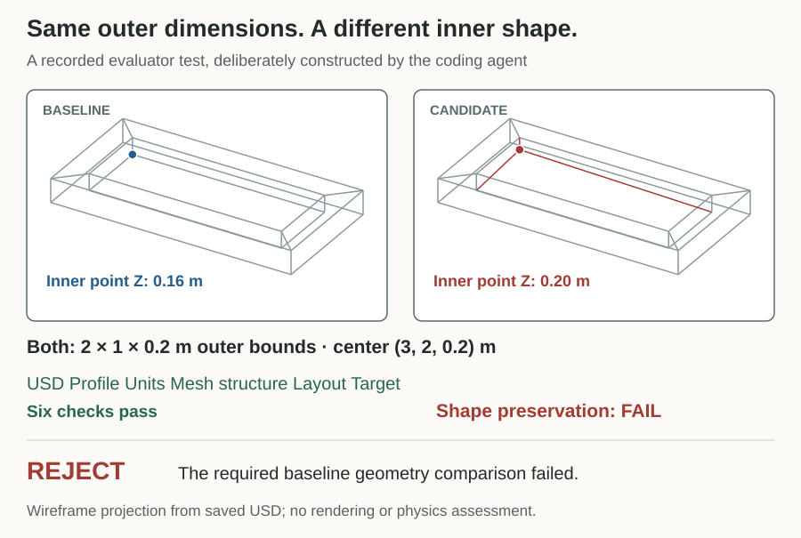
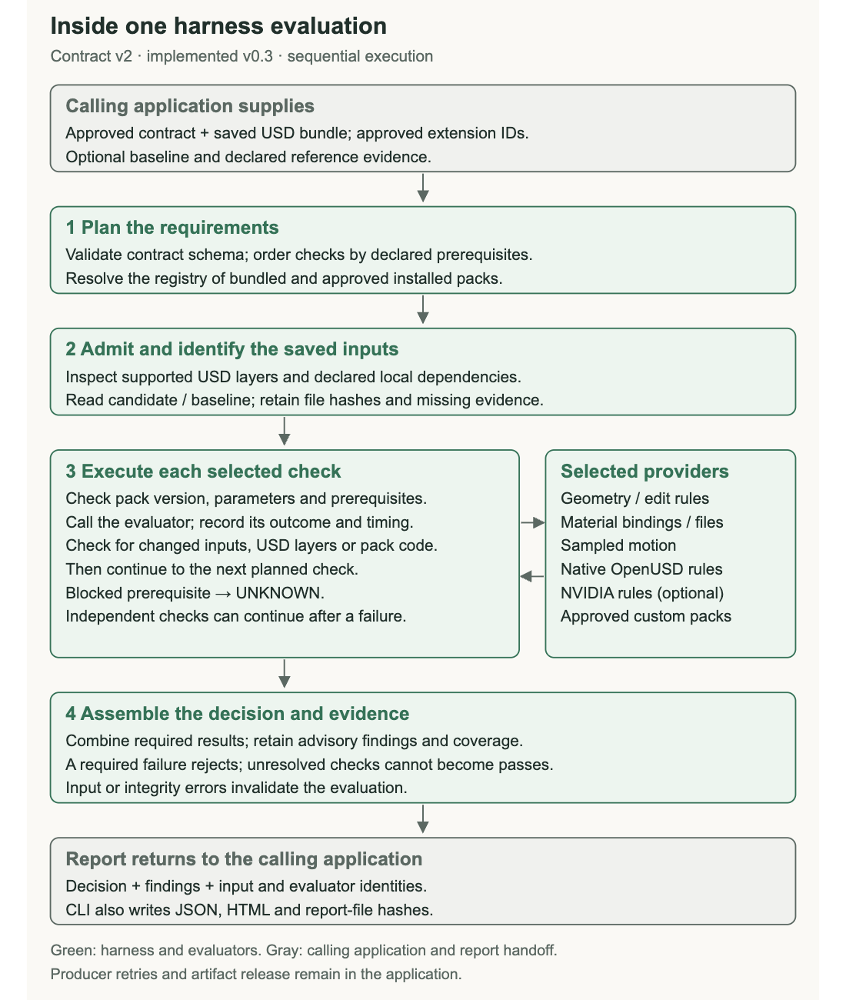

# Detailed reference

This reference retains the existing workflow and replay documentation. Start with the [README](../README.md) for the current development status and three invocation paths. New state/process packs and triage closure are documented in the [enhancement decisions](ENHANCEMENT_DECISIONS.md).

# Scene Acceptance

I built this harness to manage acceptance of a particular delivery: **which requirements apply, what evidence supports them, and what needs to happen next.** It evaluates saved OpenUSD scenes with selected checks and optional model review of caller-supplied renders. The report helps the receiving application accept within the checked scope, request evidence or send specific findings back to the producer.

A completed scene can still miss part of the brief or depend on an unsupported assumption. The useful output is **inspectable evidence**: requirements, observations, supporting records and unresolved decisions.

The intended use determines the checks. A brief can supply dimensions, timing, appearance or other requirements; general delivery policy applies alongside it. Each evaluation pack has its own depth and limits. Where a [SimReady profile](https://docs.omniverse.nvidia.com/simready/latest/simready-faq.html) fits the job, I would use its validation and runtime tests within this workflow. That integration would need an adapter; the current NVIDIA pack runs selected USD Validation rules. I would use specialist evaluators to deepen the areas a job needs.

Start with the [adopter guide](ACCEPTANCE_WORKFLOW.md) for responsibilities, your own brief and reusable evaluation packs. The [application protocol](APPLICATION_PROTOCOL.md) documents the CLI/library calls.

Simulation support is currently a fixed ramp-and-block CPU example with bounded parameter variations. It exercises the handoff from a simulator's trace to a task decision; it does not cover arbitrary articulated mechanisms or establish physical calibration. A broader acceptance report does not imply comprehensive validation in every domain.

**Status:** experimental, version [0.6.0](https://github.com/pr9868/scene-acceptance/releases/tag/v0.6.0). The harness evaluates content; the producer owns revisions. Its current packs cover bounded geometry, material delivery, sampled motion, explicit timing requirements and selected OpenUSD/NVIDIA rules. This release also includes the texture-decoding, sampled-connection and bounded simulation article packs, plus coverage-aware reports and a reusable diagnostic baseline. The [v0.3.0 release](https://github.com/pr9868/scene-acceptance/releases/tag/v0.3.0) remains unchanged.

## Why use it if the agent already has the brief?

The brief tells the agent what to build. The harness checks the saved result, retains the evidence and repeats the same checks after a repair. A producer can use it for prechecks too. A capable agent could build an equivalent process; this package makes the checks, scope and reports reusable across deliveries and applications. Its value depends on the selected checks and the quality of the approved scope.


The caller supplies captures and applies the owner's release policy. The producer handles revisions. The [adopter guide](ACCEPTANCE_WORKFLOW.md) explains each handoff and how to extend a check or review question.

## Who does what

| Role | Responsibility |
|---|---|
| Human or domain owner | Defines intended use, requirements, tolerances and acceptable tradeoffs; reviews scope and owns release policy. Routine decisions may follow that approved policy. |
| Calling application or agent | Supplies saved scenes, briefs and requested captures; invokes the harness, records approvals and routes findings to the right next action. Owns rendering and the repair loop. |
| Harness | Validates supported inputs, runs selected packs and optional review, and reports measured results, advisory opinions, coverage gaps and the scoped outcome. |
| Producer | Creates or repairs the scene against agreed requirements, returning a saved revision and fresh evidence where needed. |
| Pack maintainer | Implements or adapts measurements, states their coverage and limits, and tests passing, failing and missing-evidence cases. |

## Bring your own brief

A brief describes the job, intended use and supporting references. In a manufacturing scene it might include a P&ID, layout, equipment list, datasheet excerpts, photos and instructions. A specification states the explicit requirements within that material; the reviewed contract or map turns supported requirements into checks. See [what a brief means](ACCEPTANCE_WORKFLOW.md#what-a-brief-means) for supported inputs and engineering interpretation limits.

- **Already structured:** provide a contract selecting checks and parameters, or a mapped brief retaining source requirements and their check/review coverage. Scripts can run without an LLM.
- **Text, images and PDF pages:** use optional preparation to propose a requirement map and capture plan, review it, then evaluate against that frozen scope. Raw prose is not a direct `check-3d --brief` input.
- **A check does not exist yet:** add a tested pack or specialist adapter. For a visual question, customize the judge rubric and required views. Unmapped or unsupported requirements stay unresolved.

[Follow a brief through the workflow](ACCEPTANCE_WORKFLOW.md#bring-your-own-brief), including how a reusable check differs from a job's acceptance policy.

The harness becomes a **release gate** when the calling application requires its scoped result and any required reviews before accepting the delivery. The application retains the brief, evidence, decisions and rechecks across revisions. [This repeatable review process](ACCEPTANCE_WORKFLOW.md#make-review-a-release-gate) makes the basis for trust visible; a standalone report cannot enforce a workflow that the application bypasses.

## Assumptions and human review

Today, [declared-scope review](DECLARED_SCOPE_REVIEW.md) can retain caller-listed inferences and producer decisions, including assumptions, and require separate review. The harness does not automatically discover every hidden assumption or rank engineering risk. Required/advisory policy is supplied by the owner.

Optional [AI assumption triage](ASSUMPTION_TRIAGE.md) reviews caller-selected obligations and declared decisions after assessment. It recommends routine handling, human review or more context, citing the supplied evidence and explaining the possible consequence. The report shows that recommendation beside the applied caller policy. Mandatory reviews, required failures and missing context cannot be cleared by a reassuring model response. Try the [synthetic handoff example](../examples/assumption-triage/README.md).

Experimental [audit](EXTENSIONS.md#assumption-audit) proposes questions about undeclared choices; [external engine evidence](EXTENSIONS.md#engine-bridge-and-caller-evidence) imports caller-selected native tests. Richer assumption records, domain-specific adapters and independent discovery-quality evaluation remain in the [enhancement plan](ASSUMPTION_REVIEW_PLAN.md). The [current support and planned extensions](ACCEPTANCE_WORKFLOW.md#assumptions-and-risk-supported-today-and-planned) table separates those from the implemented triage operation. This is a review aid; its ability to recognize consequential engineering assumptions still needs independent assessment.

## What it checks today

| Capability | Required input | Result and boundary |
|---|---|---|
| General delivery checks | Saved OpenUSD bundle and installed baseline providers | 27 selected rules cover scene structure, dependencies, image decoding and authored-motion sanity. No task-specific contract is needed; intended appearance and process correctness remain outside this baseline. |
| Brief-specific measurements | Explicit contract or reviewed requirement map, named scene subjects and targets | Supported dimensions, placement, timing and sampled connections produce measured findings. Missing mappings and unsupported requirements stay visible. |
| Optional visual review | Configured model CLI, suitable caller-rendered views and a review rubric or mapped brief | Advisory opinions on visible layout, readability, material use and sampled motion. These are evidence-limited judgments, not measured passes or physical validation. |
| Optional assumption triage | Existing declared-scope assessment, selected items, text evidence, caller policy and configured model CLI | Evidence-linked AI recommendation plus deterministic review gates. No hidden-assumption discovery, calibrated risk score or new approval. |
| Source-image comparison | Selected texture/reference images and an explicit comparison policy | Decoded pixel comparisons within supported regions and limits. This does not compare the fully rendered appearance of a scene. |
| Bounded simulation evidence | The supported ramp-and-block fixture, parameters and worker dependencies | A task result for that fixed CPU model; no general USD physics import or physical calibration. |

Use `--mode checks`, `--mode judge` or `--mode both` to select evaluation. Model review is opt-in; the caller provides rendering and owns the producer/revision loop. A baseline pass does not establish that a whole brief is satisfied. See the [test inventory](TEST_INVENTORY.md) for individual checks and the [evaluation modes guide](EVALUATION_MODES.md) for view requirements and result semantics.

The [0.5 integration and release notes](INTEGRATION_RELEASE_0_5.md) cover scope routing, judge coverage drift, caller-attested renderer libraries and versioned replay.

The [October 3 compatibility and review fixes](COMPATIBILITY_AND_REVIEW_FIXES.md) describe connected texture inputs, MDL library classification, separate visual-reference and pixel-comparison limits, timing boundaries, policy-bound approvals and verified worker identities. These fixes are included in 0.5.0; historical results retain their original policy and runtime.

The [timing walkthrough](MOTION_TIMING.md) reproduces a gap in a time-code-only contract, then rejects a changed playback rate while accepting a correctly rescaled animation. Producer prechecks may use the same harness; the consuming application still owns the approved requirements and acceptance of the delivered revision. Shared validators can share bugs, so reference cases and coverage review remain necessary.

## Prepare a brief and request caller evidence

For a saved scene and raw text/image brief, follow the [complete preparation example](PREPARATION_AND_SKILLS.md#invocation): **prepare → review and approve the scope → capture views → validate evidence → evaluate → follow the reported next action**. The interpreter proposes a frozen requirement map and capture plan; it cannot guarantee complete interpretation. The caller reviews that map, renders the requested views and returns a receipt. Scripts, model opinions and missing evidence remain separate. Two reusable adopter skills ship in the wheel and can be exported with `check-3d-skills --out NEW_DIRECTORY`.

## See what a run checked

The [two-scene repair case study](../examples/two-scene-repair-study/README.md) follows a dairy binding defect and a 125,000-prim distribution-centre delivery through feedback and repair. Its selected evidence distinguishes a scene defect, an unstated delivery policy and a route-state problem found by separate review. The larger trial used an unreleased development build and custom pack; the evidence collection does not extend the capabilities of the current release or provide a full replay of those builds.

The [test inventory](TEST_INVENTORY.md) explains each baseline rule, configurable check and advisory review item. `check-3d --list-tests` returns the catalog; `--capabilities` returns the invocation/evidence schemas. The [unified CLI guide](EVALUATION_MODES.md) covers `--mode checks`, `--mode judge` and `--mode both`, with an optional mapped brief and caller-configured model CLI. Measured results and evidence-bounded opinions stay separate. Omitting `--mode` preserves the existing scripted invocation below.

The [reporting guide](REPORTING.md) covers the reusable 27-check baseline, per-object outcomes, coverage gaps, CSV exports and batch reports. Install optional providers and run:

```sh
python -m pip install -e '.[nvidia,article_checks]'
check-3d --bundle-root /path/to/delivery \
  --candidate scene.usda --max-dependency-files 256 --out /path/to/new-report
```

With no brief, contract or review plan, the command selects the 27-check general baseline. `--profile usd-delivery-baseline` remains an equivalent explicit selection. The report separates passes, failures, warnings, skipped subjects and unknown evidence. Object inventory is not the same as evaluated coverage. Task-specific motion, appearance and simulation requirements still need explicit contracts and suitable evidence.

The report now starts with [the scene and its specifications](SCENE_AND_SPECIFICATION_REPORTS.md): saved structure, general checks versus checks linked to supplied requirements, a simple outcome matrix, and coverage/gaps for each specification. Human input is labeled only when its source is explicitly recorded; presets and unrecorded sources remain distinct.

[Text/image briefs and optional model review](BRIEFS_AND_MODEL_REVIEW.md) add `check-3d --brief`: original source files, an explicit requirement map, reference-image comparisons and unchanged-input receipts. A separate, opt-in `check-3d-judge` command can request advisory analysis through a caller-configured CLI. It never changes the scripted verdict or supplies human approval. Sample briefs and deterministic adapter controls are included; no model is called during ordinary checks or software tests.

The primary application interface is the executable. [Call the harness from an application](APPLICATION_CLI.md) describes scene/brief inputs, JSON results, exit handling and runnable Python/Node host examples. An application launches the process and reads its report. The [HTTP proposal](HTTP_API_PROPOSAL.md) is retained as an optional future wrapper for remote execution; no HTTP service is implemented.

The [brief-depth study tooling](../evaluation/brief-depth-v1/README.md) prepares three synthetic scene families at four levels of creation detail, preserves first deliveries and compares general checks, supplied requirements and a shared full target. It includes frozen measurement controls, separate denser motion sampling and reports with exact affected subjects. Model generation is explicit and separate from replaying saved evidence. Owner-local results are not part of the public release.

The distribution also consolidates [21 supplemental checks](SUPPLEMENTAL_CHECKS.md) and the [five-layer declared-scope review](DECLARED_SCOPE_REVIEW.md). Use `check-3d --review-plan` for one report containing artifact findings and requirement/review gaps. The generic baseline remains 27 checks; the four-job preset requires explicitly selected target requirements. These integrations are included in 0.5.0.

```sh
python examples/declared-scope/prepare.py --out /tmp/declared-scope-example
# Run the command printed by the example. Expected: NEEDS_REVIEW.
```

The example deliberately leaves continuous-motion evidence and mapping approval pending. See the [consolidation protocol](../evaluation/consolidation-v1/PROTOCOL.md) and [results](../evaluation/consolidation-v1/RESULTS.md) for verification and limits.

## Try a passing edit and a rejected edit

Use Python 3.12. These commands install the core and its pinned test dependencies; NVIDIA and the experiment tools are optional for this first example.

```bash
git clone --branch v0.6.0 https://github.com/pr9868/scene-acceptance.git
cd scene-acceptance
python3.12 -m venv .venv
source .venv/bin/activate
python -m pip install -r requirements-test.lock
python -m pip install --no-deps --no-build-isolation .

check-3d \
  --bundle-root evaluation/mesh-v1/fixtures/translated_mesh \
  --contract contract.json --candidate scene.usda \
  --baseline baseline.usda --out /tmp/scene-accepted-01
```

Expected: `ACCEPT_FOR_USE`, exit code 0. Open `/tmp/scene-accepted-01/report.html` to see the requirements and their individual results.

Now check an edit whose outer dimensions are right but whose interior changed:

```bash
check-3d \
  --bundle-root evaluation/mesh-v1/fixtures/interior_shape_changed_same_bounds \
  --contract contract.json --candidate scene.usda \
  --baseline baseline.usda --out /tmp/scene-rejected-01
```

Expected: `REJECT`, exit code 2. Six checks pass; shape preservation fails because an interior point moved by 40 mm. This is a deliberately constructed evaluator test, not an observed agent failure.



Choose a new output directory for each run. Outputs must be outside the submitted bundle. Relative input paths resolve inside `--bundle-root`. A command-line usage error returns 4. Measured scene rejection returns 2; scope review or missing evidence returns 3. Use the structured report and its next action to decide what to do next.

## Evaluate a larger local bundle

The default dependency budget is 64 files per scene, including its root USD layer. The calling application can raise it for a larger approved delivery without editing the contract or flattening the scene:

```bash
check-3d --bundle-root ./delivery --contract contract.json \
  --candidate scene.usda --max-dependency-files 256 --out /tmp/larger-scene-01
```

The Python API accepts the same `max_dependency_files=256` keyword. Values must be integers from 1 to 1024. The report records the selected budget in `runtime.admission_limits`. Exceeding it produces `INSUFFICIENT_EVIDENCE` (CLI exit 3), with a `resource_limit` observation and unexecuted checks left `UNKNOWN`. This records a coverage gap; it does not establish a scene defect.

The budget belongs to the caller, not the submitted contract. Unique local layers and external assets count toward it, including missing declared assets; the root counts once and repeated dependencies count once. The limit applies separately to candidate and baseline. The 32 MiB per-file limit, 10,000-prim limit, dependency allowlist, path containment and supported-composition rules still apply. This option does not add a default validation profile or change acceptance criteria. Run large evaluations in a caller-managed process with a suitable memory and time budget.

## How it fits into an application



The core validates the contract, admits supported inputs, resolves approved packs, runs checks in prerequisite order and produces `result.json`, `report.html` and a manifest. Required checks determine the overall result; advisory findings remain visible. A failed prerequisite leaves its dependent checks unresolved.

| Result | What the caller can conclude |
|---|---|
| `ACCEPT_FOR_USE` | The required checks passed for this contract and submitted revision. Unchecked properties remain outside that conclusion. |
| `REJECT` | A required check found a violation. Other errors or missing evidence remain visible. |
| `INSUFFICIENT_EVIDENCE` | A required obligation could not be established from the supplied evidence. |
| `EVALUATION_ERROR` | Input, integrity or evaluator problems prevent a valid acceptance result. |

The caller owns the brief, approved providers, references, retry policy and release. Packs execute trusted Python in-process. There is no hostile-plugin sandbox, enforced execution timeout, worker scheduler or automatic repair loop.

## Evaluation packs

| Pack | Included evaluation | Current limit |
|---|---|---|
| `openusd` | Explicitly selected native validators | The selected rules' scope; a clean result does not establish every requirement in a brief. |
| `geometry` | Cube and polygon geometry, placement, bounds and declared edit constraints | Bounded representations; shape-preserving translation uses corresponding points/connectivity. |
| `materials` | Resolved bindings, expected surface shader IDs and declared dependencies | Binding/file checks only; image decoding and source-pixel comparison are separate checks below. No rendered appearance acceptance. |
| `scene.audit` / `textures.decode` | General file/image/motion diagnostics and explicit image decoding | Decoding establishes readable supported images, not correct UV mapping or visual quality. |
| `brief.measurements` | Named bounds, child counts, axis gaps, metadata and source-image pixel comparisons | Bounded targets; no walkability, whole-scene rendered comparison or machine-function proof. |
| `motion` | World-space transform origins at contract-specified time codes | No whole-interval collision, orientation or dynamics proof. |
| `motion.timing` | Authored duration, optional exact clock rate, and sampled origins at elapsed seconds | Separate from the legacy time-code check; does not infer active motion duration or prove a continuous path. |
| `nvidia.asset-validator` | Explicitly selected NVIDIA USD Validation rules | Optional dependency; no SimReady certification or automatic fixers. |
| `studio.mesh-budget` | A separately installed example of a consumer's polygon budget | Example extension; face count does not establish rendering performance. |

Inspect the installed catalogue:

```bash
check-3d-packs
check-3d-packs --upstream openusd
python -m pip install '.[nvidia]'
check-3d-packs --upstream nvidia
```

Available names describe discoverability. They do not mean that every upstream rule has been exercised. A required but unavailable provider produces an evaluation error.

OpenUSD and NVIDIA validators already cover more than syntax and allow custom rules. This project combines their selected results with application requirements, evidence and revision identity. It does not claim a new category of semantic validation.

## Libraries and why I included them

| Library | Role |
|---|---|
| OpenUSD (`usd-core` 25.11) | Compose admitted scenes, inspect geometry/materials/transforms and run selected native validators. |
| JSON Schema (`jsonschema` 4.25.1) | Validate contracts, parameters and structured records. |
| NVIDIA USD Validation 1.20.0 | Reuse selected asset and physics configuration rules through an optional adapter. |
| Pillow 12.3.0 | Decode admitted image evidence and source textures; compare explicitly selected source pixels. |
| MuJoCo 3.6.0 | Execute the restricted two-box incline experiment on CPU. |
| NumPy 2.5.3 | Support the experiment's numerical operations. |

Some rules overlap. I would choose the checks at runtime through the application's contract, retaining overlap when it supplies useful evidence. The base install requires only OpenUSD and JSON Schema. The full replay adds the optional packages with pinned versions. Dependencies retain their own licenses; see [third-party dependencies](../THIRD_PARTY_NOTICES.md).

## Reproduce the retained results

From the project root, with the environment above active:

```bash
python -m pip install -r requirements-articles.txt
python -m pip install --no-deps --no-build-isolation ./examples/studio-mesh-pack
python reproduce.py --out /tmp/scene-acceptance-replay-01
```

The output directory must be new and outside this checkout. The replay verifies the distribution hashes and installed implementation identity before and after execution, and compares the new decisions and physics observations with the retained records. Changed pack pins are proposed explicitly in separate replay copies, with `contract-upgrades.json` recording each change. The original inputs and reports remain unchanged; direct evaluation rejects outdated pins.

| Evidence | What is reproduced |
|---|---|
| Software tests in this checkout | Core, pack, CLI, approval, evidence and integration regressions. The executed count and zero-failure requirement are recorded in the replay’s `pytest.xml` and `verification.json`. These tests include cases counted below. |
| 22 pack cases | Selected validators, materials, motion, external packs and error handling. |
| 32 mesh cases | Prior geometry and edit decisions, including the changed interior. |
| 17 timing cases | Clock changes, legal rescaling, duration, sampled seconds and unusable timing evidence. |
| Four content probes | Material decoding and motion-sampling coverage comparisons. |
| Three configuration cases and four CPU simulation runs | Positive/negative mass controls, then two friction assumptions at two timesteps. |

The counts overlap and are not independent model samples. The replay makes no model calls. The retained runs were developed on Python 3.12 and macOS arm64; see the release checks for the environments actually exercised. Other platforms need compatible wheels and their own verification.

The first pack run matched 19 of 22 expected decisions. Three texture-dependency cases falsely accepted. Explicit asset-attribute inspection corrected the reader, and the unchanged cases then matched 22 of 22. Both stages remain in the repository. A historical competent-script comparison tied on 18 shared cases, so these results do not establish an accuracy advantage over a suitable script.

## Inspect the evidence by question

- [Astra mechanical assembly](https://github.com/pr9868/scene-acceptance/blob/v0.5.0/examples/astra-mechanical-assembly/README.md): the recorded producer delivery, portable viewer, checks and evidence limits.
- [Evidence guide](EVIDENCE.md): where to find protocols, fixtures, first failures, corrected results and historical model outputs.
- [Historical material-delivery probe](../article-evidence/content-probes): binding/file checks alone accept an unreadable PNG. Version 0.5.0 adds decoding in the general baseline and a selectable image-decoding check; the retained probe isolates the narrower check. [Workflow](images/materials-flow.png).
- [Motion sampling](../article-evidence/content-probes): the same motion accepts at three requested times and rejects when a missed excursion is checked. [Workflow](images/motion-flow.png).
- [Motion timing](MOTION_TIMING.md): require the declared duration and sample positions in elapsed seconds; preserve valid clock/keyframe rescaling.
- [Physics experiment](../article-evidence/physics-experiment): selected configuration rules pass while task behavior differs with assumed friction. [Workflow](images/physics-flow.png).
- [Pack API](PACKS_API.md) and [external example](../examples/studio-mesh-pack): how to add another evaluation without modifying the core.

## What I want to test next

My next application trial would use independently supplied edit briefs and a producer connected by the caller. I would record first-attempt acceptance, violations missed by the evaluator, false rejections, unresolved requirements, repair attempts, total runtime cost and human review time. Comparing contract prechecking with findings received only after submission would test whether that feedback helps the producer.

The [trial protocol](../evaluation/producer-trial-v1/PROTOCOL.md) defines the inputs, comparison and record before execution. It is awaiting an independently supplied brief and external assessment; no workflow benefit is reported from that plan.

Version 0.5.0 includes the bounded texture-decoding, sampled-connection and incline-worker follow-ups, source-image pixel comparisons and optional advisory review of supplied renders. The historical v0.3.0 release remains unchanged. General continuous-motion guarantees, arbitrary physics import, deterministic comparison of fully rendered scene appearance and physical calibration remain future work.

## Contribute

Start with a consuming requirement and a failing example. Add checks as an external pack when possible, using the [contribution guide](../CONTRIBUTING.md). A useful contribution states what it measures, what it cannot establish and how another person can reproduce both passing and failing cases.

This is an AI-assisted project directed by Pradeep Kaushik. The recorded experiments are development probes with shared authorship of briefs, implementation and review. They are not an independent benchmark, a productivity study or validation against measured physical behavior.

MIT licensed. See [LICENSE](../LICENSE). Project context: [roughcut.dev](https://roughcut.dev).

**Disclaimer:** The views and opinions expressed in this account are those of my own and do not represent those of my employer, NVIDIA.
