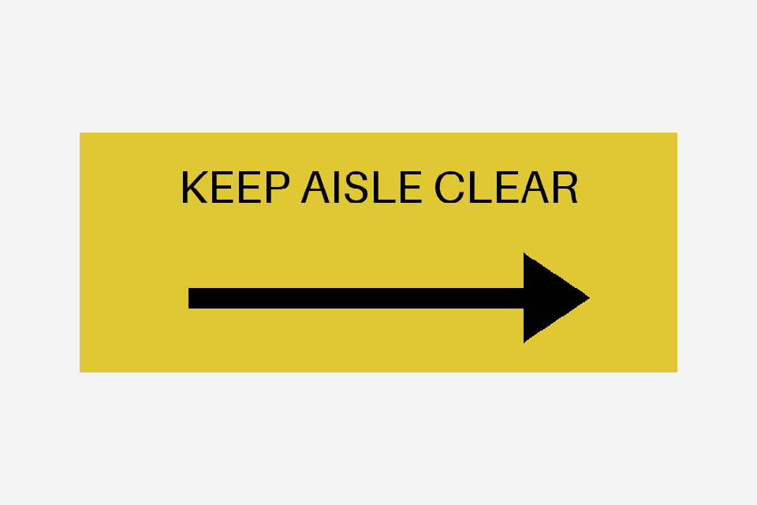
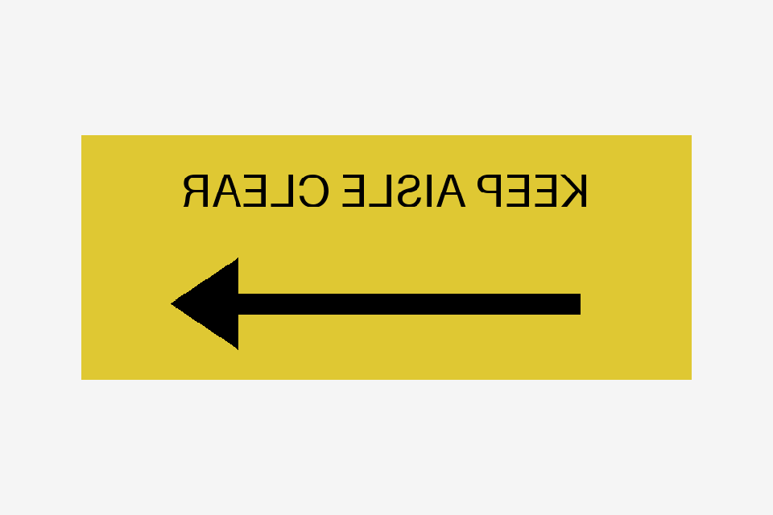

# Does rendered evidence add anything?

For this small sign control, yes. The source texture is identical in all variants. Mirroring only the saved UV coordinates reverses the visible lettering and arrow. Structural checks and source-pixel comparison pass; a fresh visual judge flags the mismatch.

| Saved scene / evidence | Structural checks | Source-image check | Visual result, two repetitions | What this establishes |
|---|---|---|---|---|
| Normal lettering, arrow right | Pass | Pass | Consistent, consistent | The supplied front view supports the stated appearance. |
| Mirrored UVs, arrow left | Pass | Pass | Concern, concern | Rendered evidence exposes a defect source-image comparison cannot see. |
| No rendered view supplied | Pass | Pass | Unknown, unknown | The harness stops at the evidence gap without spending a model call. |
| Sign hidden behind another object | Pass | Pass | Unknown, unknown | Supplied image metadata does not prove the sign is visible. |

The confirmed comparison used six fresh judge calls, requesting `gpt-6-astra` at high effort. The two missing-view cases were deterministic guards. The resolved model snapshot was not independently verified. These are constructed developer controls with a focused criterion, not a detection-rate estimate or a test of the earlier conveyor's exact sign/camera. Audit, triage calibration and reviewer-time savings remain separate questions.

| Correct | Mirrored | Occluded |
|---|---|---|
|  |  |  |

The caller rendered the saved USD with a CPU z-buffer renderer supporting the fixture's mesh UVs and material. These are diagnostic views, not RTX or calibrated photorealism. The harness itself performs no rendering. The first fixture attempt lacked an authored mesh extent; NVIDIA's selected extent rule correctly rejected it. We retained that attempt, added the missing extent and repeated the frozen comparison. The table above is the corrected-fixture confirmation; the earlier attempt is not counted as additional clean trials.

## Preparation controls

Two fresh interpreter runs on a small explicit clearance brief both selected the correct subtree without a revision. To exercise the optional revision path, we separately seeded an aggregate Xform in a leaf-only obstacle list. One fresh revision changed that binding to the exact subtree selector. Preflight changed from unresolved to ready; the closed-solid requirement, prohibited contact, zone, numerical margin and all requirements stayed fixed. This demonstrates one constrained repair, not the frequency or reliability of interpreter self-correction.

Replaying the retained process-skid interpretation still exposes two unmeasurable aggregate-target checks and a plan needing **13 image slots with 8 available**. Preparation now retains the proposal with exit 3, `ready_for_capture: false` and `next_action: revise_preparation`. It does not ask the builder to repair the scene. That run reused an earlier answer and is labelled as replay; it is not another fresh interpreter test.

[Machine-readable summary](summary.json) separates the visual opinions, pixel comparison, fresh interpretation and seeded revision. The complete original delivery packet is not redistributed here. The public fixture below is independently runnable and does not require those retained scenes.

## Run it

With the package, OpenUSD, NumPy and Pillow installed:

```sh
# Make saved USD and caller-rendered views without any model call.
python evaluation/model-workflow-v1/create_visual_controls.py --out /tmp/sign-controls

# Optional: six fresh judge calls at the default two repeats, plus two no-view guards.
# Your model config explicitly chooses the executable/provider/model.
python evaluation/model-workflow-v1/run_visual_review.py \
  --model-config /path/to/caller/judge.json --out /tmp/sign-review
```

Both commands require new output folders. The second retains per-run combined reports, native responses and a summary. It can send the explicit evidence to the configured model provider. Use a multimodal configuration; a text-only adapter does not establish visual evidence. The public adapter example describes how to attach the supplied images.

Protocol/regression tests make no external model calls:

```sh
python -m pytest -q -rs tests/test_model_workflow.py tests/test_public_adapter.py
```

Those controls cover full-inventory reference validation, omitted-measurement guards, named errors, scene identity, readiness and diagnostic behavior, bounded revisions, rejected policy weakening and explicit replay identity. They are software tests, not model-quality measurements.
