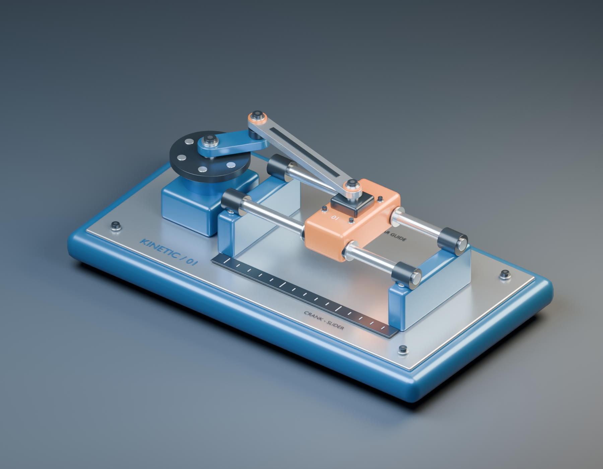

> Public distribution: local paths and launch instructions were adapted after the recorded run. See [publication notes](../PUBLICATION.md) and the file manifest for the differences.

# Kinetic 01 — tabletop crank-slider

A procedural assembly with a blue structure, metallic linkage and shafts, orange carriage, and dark rubber feet. A 35 mm crank drives a 110 mm connecting rod and a carriage on two straight rails. One revolution lasts four seconds. All geometry was created for this brief; no finished models, external image assets, paid services, or publishing were used.



**Open the viewer**

From this directory:

```sh
python3 scripts/serve.py
```

Open **http://127.0.0.1:8765/viewer/**. If port 8765 is already running from this session, open that URL directly. Stop a foreground server with Ctrl+C. `--port 8766` selects another port.

Drag to orbit, scroll to zoom, and right-drag to pan. Use the play/pause button or Space (when a control is not focused). Scrubbing pauses playback; arrow keys adjust a focused timeline. Perspective, Top, and End buttons reset the camera. Restart returns to zero and preserves the playback state.

The viewer **loads `output/crank_slider.glb`**, not USD or Blender. Its single four-second animation contains all three moving transforms. Three.js plays these saved animation tracks; it does not independently solve the mechanism. The slider readout comes from the loaded slider-pin transform. Everything needed at runtime is local, including Three.js and its loaders. Serve the directory over HTTP; opening the HTML using `file://` is not supported by browser module/fetch security rules. The server binds only to localhost.

**Deliverables**

| Path | Purpose |
| --- | --- |
| `output/crank_slider.usdc` | Compact editable USD, 107 meshes, named hierarchy, seven bound preview materials, animated transforms |
| `output/crank_slider.usda` | Equivalent text-editable USD companion |
| `output/textures/color_455881.hdr` | Generated constant-color studio environment referenced relatively by both USD files; keep alongside them |
| `output/crank_slider.blend` | Working Blender scene with original geometry, bevel modifiers, materials, keyframes, lights, ground, and camera |
| `scripts/build_scene.py` | Procedural Blender generator; dimensions are in metres |
| `scripts/finalize_usd.py` | Required USD timing and continuous-angle correction, then ASCII export |
| `output/crank_slider.glb` | Self-contained browser model; meshes include the evaluated bevel modifiers |
| `viewer/index.html`, `viewer/app.js`, `viewer/style.css` | Local interactive viewer source |
| `output/overview.png` | 1800 × 1400 Cycles render of the actual source scene at frame 35 / 52.5° |
| `output/viewer-overview.png` | Actual desktop Chrome screenshot at the same pose |
| `logs/` | Build output, initial failures, validations, and top/end/mobile browser screenshots |

The USD export contains the assembly and generated environment. The Blender source additionally retains the photographic presentation setup. The browser uses its own local procedural lighting and shadows. Geometry and saved motion match; shading is not expected to be pixel-identical across renderers. USD is an editable polygon scene, not a CAD solid model.

**Timing, axes, and motion**

USD metadata explicitly sets `metersPerUnit = 1`, `upAxis = Z`, `framesPerSecond = 60`, `timeCodesPerSecond = 60`, `startTimeCode = 0`, and `endTimeCode = 240`. There are 241 samples including identical endpoint poses: `(240 − 0) / 60 = 4 s`. Configure a USD player to repeat that interval; USD stage metadata itself does not force a player's repeat mode. The browser loops automatically.

The crank turns counterclockwise viewed from +Z. In source/USD coordinates, X is slider travel, Y is the transverse direction on the base, and Z is up. glTF uses Y-up: `(x, y, z)USD → (x, z, −y)GLB`.

The following **Xform origins** identify ideal pin centers at the rod center plane, not bolt-cap surface centers:

| Datum | Exact USD prim path |
| --- | --- |
| Crank center C | `/root/CRANK_SLIDER_ASSEMBLY/Crank_Center` |
| Crank pin P | `/root/CRANK_SLIDER_ASSEMBLY/Crank_Rotation/Crank_Pin` |
| Slider pin Q | `/root/CRANK_SLIDER_ASSEMBLY/Slider_Translation/Slider_Pin` |
| Rod local frame | `/root/CRANK_SLIDER_ASSEMBLY/Connecting_Rod_Pose` |

At time `t` seconds, use `θ = 2πt/4`, `r = 0.035 m`, `L = 0.110 m`:

```text
C = (−0.090, 0, 0.102)
P = (Cx + r cos θ, r sin θ, 0.102)
Q = (Px + sqrt(L² − Py²), 0, 0.102)
rod angle = atan2(−Py, Qx − Px)
```

The rod's local endpoints are `(0,0,0)` and `(0.110,0,0)`. Q travels from X = −0.015 m to +0.055 m, giving a 70 mm stroke. At frame 0, P is `(−0.055,0,0.102)` and Q is `(0.055,0,0.102)`; at frame 120, P is `(−0.125,0,0.102)` and Q is `(−0.015,0,0.102)`. Full quarter-cycle readbacks are in `logs/usd-validation.json`.

The animation is sampled at 60 Hz with linear interpolation. Interpolated rod/pin positions differ by a few micrometres between authored samples; the hardware remains visually connected. This is a numerical animation approximation, not a measured material property or physical accuracy claim.

**Rebuild and revise**

The supplied environment uses two separate Python runtimes to avoid Blender/OpenUSD library conflicts:

```sh
sh scripts/rebuild.sh
```

The public distribution defaults to `.venv-blender/bin/python` and `.venv-usd/bin/python` in this directory. Set up separate environments, on a platform supported by these packages:

```sh
python3.11 -m venv .venv-blender
.venv-blender/bin/python -m pip install bpy==4.5.12
python3.12 -m venv .venv-usd
.venv-usd/bin/python -m pip install usd-core==25.11
```

Override `BLENDER_PYTHON` and `USD_PYTHON` to use existing installations. Node is needed for validation, not to serve the viewer. The vendored client and validator need no package installation. Rebuilding overwrites `output/` and validation logs; work on a copy if retaining the recorded delivery.

The build generates the Blender scene, USD, GLB and render, then finalizes the USD and runs readback and validation. A shader registry unavailable to the compliance checker remains an incomplete check; the script does not turn that into a full compliance pass.

Revise named objects and material nodes directly in `crank_slider.blend`, or edit the geometry and kinematic equations in `build_scene.py` and regenerate. The file is deliberately procedural and all lengths use metres. If changing radius, rod length, timing, or center location, update the related geometry, animation, metadata finalizer, viewer labels/readouts, and validation expectations together. Hand edits to `.blend` are not incorporated when running the generator. The finalizer currently encodes the specified 360°/240-frame crank rotation and must be revised for different timing.

For separate checks, with the viewer server running on 8765:

```sh
.venv-blender/bin/python scripts/check_source.py
.venv-usd/bin/python scripts/validate_usd.py
.venv-usd/bin/python scripts/check_usd_compliance.py
node scripts/validate_glb.cjs
node scripts/test_viewer.mjs
```

`test_viewer.mjs` imports the local `playwright` package. Run `npm install --no-save --package-lock=false playwright@1.62.1` and `npx playwright install chromium` in this directory. Set `CHROME_EXECUTABLE` to test an existing Chrome installation and `VIEWER_URL` if using another local port. It creates an isolated context and expects local-only requests. The source check reopens the saved `.blend` without rewriting it.

**Tools actually used**

| Tool | Version / role |
| --- | --- |
| Python / bpy | Python 3.11.15; Blender 4.5.12 LTS, generation/export/Cycles render/source readback |
| Blender glTF exporter | Khronos glTF Blender I/O 4.5.51 |
| OpenUSD `pxr` | 25.11, separate Python 3.12 runtime, metadata editing and readback |
| Three.js | 0.180.0, vendored with OrbitControls, GLTFLoader, RoomEnvironment, BufferGeometryUtils |
| Node.js | 24.15.0, browser test runner and GLB validator |
| Playwright | 1.62.1 |
| Google Chrome | 153.0.8010.50, headless local browser testing |
| Khronos glTF Validator | 2.0.0-dev.3.10, vendored in `tools/gltf-validator/` |

Blender rendering produced the PNG directly. No AI image generation was used. Three.js's MIT license and the validator's package/license files are retained with their vendored code. Download logs are retained; fetched package archives and unused runtime bundles are omitted from this public distribution. The supplied Pillow and imageio-ffmpeg packages were not used to create the deliverables.

**Checks and observed results**

- Source: reopened the `.blend`; verified scale, timing, camera, render settings, and pin distances at all 241 frames. See `logs/source-validation.json`.
- USD: opened the actual `.usdc`; checked 961 frames/subframes, mesh points, bound materials, stage metadata, rod endpoints, fixed guide, analytic slider position, and the loop seam. Maximum observed discrepancy was approximately 0.00396 mm. See `logs/usd-validation.json`.
- GLB: Khronos validator reported **0 errors and 0 warnings**. It also emitted 105 informational unused-UV notices because materials do not use texture maps; these are retained in `logs/gltf-validator.json`.
- Browser: loaded the actual GLB, checked 481 poses, nominal dimensions, rod endpoint connections, playback/pause, frozen paused pose, timeline and keyboard scrubbing, wraparound, restart, pointer orbit, wheel zoom, presets, and mobile layout. Final run reported no JavaScript console errors or failed network requests. See `logs/browser-validation.json` and screenshots.
- USD assets: the generated HDR resolves locally, with no unresolved dependencies. Full shader compliance is **unverified**: the supplied OpenUSD package lacks discoverable `shaderDefs.usda` resources and cannot find the standard `UsdPreviewSurface` shader in its registry. The compliance script reports `INCOMPLETE` and preserves the exception/check failures. It does not classify these as a successful full compliance check. The scene's seven materials do author `UsdPreviewSurface`, and their bindings were checked independently.

**Problems encountered and corrections**

1. npm's default cache was not writable. Retried with a cache inside this workspace; no permissions or user files were changed (`logs/npm-pack.log`, `logs/npm-pack-retry.log`).
2. Blender's USD export set time codes to 60/s but left display FPS at 24. The required finalizer sets both to 60.
3. USD Euler angle wrapping caused the crank pin to take a wrong interpolation path around 180°. The initial subframe test caught an approximately 70 mm deviation. The finalizer authors monotonically increasing 0–360° samples; final readback passes (`logs/usd-validation-initial-failure.log`).
4. Initial GLB scene export produced three clips, which the viewer explicitly rejected, and did not apply bevels. Exporting active actions together and applying mesh modifiers produced one synchronized animation and matching rounded geometry (`logs/browser-initial-failure.log`, `logs/browser-failure.png`).
5. Initial overview exposure was reduced for clearer material contrast. Narrow browser framing was adjusted after inspecting the mobile screenshot.
6. The optional full USD compliance checker encountered the missing shader registry described above. This environment limitation remains recorded in `logs/usd-compliance-initial-failure.log` and `logs/usd-compliance.json`.

No forces, friction, dynamic simulation, mechanical clearances, interference sweep, bearing fits, manufacturing tolerances, or load capacity were validated. Some hardware is representational: screw recesses are dark inserts, bushings are overlapping cylinders, and fasteners have no thread geometry. Browser testing covered the supplied desktop Chrome and an emulated narrow viewport; Safari, Firefox, touch hardware, USD application rendering, and CAD round-tripping remain unverified.
