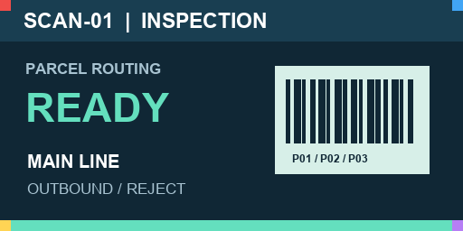

# Automated distribution centre — OpenUSD scene brief

**Version 1.0 · 5 October 2026 · Issued for production**

Create a realistic, editable scene of a fictional distribution centre. A viewer should understand goods arriving at docks, entering storage or parcel handling, passing a scanner and sorter, and reaching outbound lanes. Deliver a detailed facility and a short, readable operating sequence. All dimensions and timings below are original scene requirements, not claims about a real facility or engineering standards.

## 1. Scale and representation

Use a building approximately **120 m × 96 m**, with **14 m** clear internal height. Author metres explicitly, Z-up, a default prim and a portable OpenUSD entry stage with local relative dependencies. Equipment, storage, structure, services, annotations, lights, cameras and animation must be separately organised. Tagged equipment must remain individually selectable.

The composed delivery must contain **more than 100,000 active, defined prims**, with a target of **110,000–150,000**. Count with ordinary `Usd.Stage.Traverse()` after opening the delivered entry stage; exclude the pseudo-root. Report inactive/undefined prims, instance proxies, point-instancer instances and prototype contents separately. An instance-expanded estimate does not replace this count.

The count must come from useful modeled content: rack members, pallet components, cartons, rollers, motors, sensors, supports, service routes and building detail. Do not add empty transforms, invisible duplicates, unused materials, coincident meshes or unnecessary mesh splits to reach it. Report geometry prims separately from organisational and shading prims, plus counts by facility zone and asset family. Repetition is appropriate for storage, but the scene also needs distinct equipment, operational interfaces and visible detail.

Use sensible asset reuse and composition. Do not globally flatten or de-instance a well-structured scene merely to inflate a count. If an efficient representation prevents meeting the requested composed count, explain the conflict before declaring completion; retain the honest counts and source structure.

## 2. Required facility content

| Area | Required content and distinguishing detail |
|---|---|
| Receiving | Six dock positions with doors, bumpers, levellers, signs and staging pallets; at least one visibly open dock |
| Storage | Sixteen rack rows, organised as eight back-to-back pairs; 24 bays per row, five storage levels and two pallet positions per bay: 3,840 positions |
| Stored goods | Populate 70–80% of positions; retain a position/occupancy inventory. Use at least 12 load configurations varying carton sizes, stacking, wrap and pallet condition. Model visible pallet boards/blocks and carton shapes at a useful level of detail |
| Infeed | Two roller-conveyor lines with frames, rollers, motors, guides, supports and a visible merge |
| Inspection | One scanner tunnel, one weighing section, local sensors and operator cabinet |
| Sortation | A main transfer route, at least four visible diverters, four outbound lanes D01–D04 and a separate reject lane R01 |
| Packing | Four stations with benches, carton supplies, label applicators and work lights |
| Internal transport | Two pallet trucks and one shuttle/cart with a distinguishable carrying platform; only the shuttle needs animation |
| Services and access | Lighting, cable trays, service drops, guardrails, emergency-stop devices, marked pedestrian paths and maintenance access |

Give machines and route junctions stable tags. Assign unique IDs to rack positions and animated parcels. The conveyor route list must name each source, destination and transfer interface. No external brand or confidential layout is required. Record sources and licences for any reused assets.

Include a saved overview for each of four zones: receiving, storage, sortation and packing/outbound. Provide a loading dock cross-section, an aisle view showing the five storage levels, a scanner close-up and a diverter close-up. A rack bay must include uprights, beams, bracing, foot plates and visible attachments; a conveyor section must include carrying surfaces, frames, supports, a drive housing and visible sensor mounting. Detail should survive equipment-scale views, rather than exist only in the distant overview.

Arrange storage behind the handling area, with staging space at docks and an understandable route from infeed to outbound. Rack aisles must have at least **3.2 m** clear width; the main cross-aisle at least **4 m**. Provide a continuous **1.2 m** pedestrian route. Maintain **2.2 m** head clearance over that route. These are visualization targets, not certified safety clearances.

At each intended conveyor transfer, the route centreline endpoints must meet within **10 mm** and the carrying surfaces must align vertically within **5 mm**, unless an explicitly modeled ramp bridges a declared height change. Keep support legs on supporting surfaces within **5 mm**. Intentional equipment fasteners and structural joints may intersect; unrelated objects must not visibly occupy the same space.

## 3. Authored operating sequence

Save an animation lasting **30 seconds**, with `timeCodesPerSecond = 24`, `framesPerSecond = 24`, and time codes **0–720**. Save motion in the USD, not only in a video or live script. The sequence may be kinematic. Physical contact simulation, throughput validation and robot navigation are outside scope.

| Item | Required sequence |
|---|---|
| Parcel P01 | Pass the scan plane at **4.0 ± 0.25 s** and enter lane D01 at **18.0 ± 0.5 s** |
| Parcel P02 | Pass the scan plane at **8.0 ± 0.25 s** and enter reject lane R01 at **20.0 ± 0.5 s**; do not enter an outbound lane |
| Parcel P03 | Remain stopped at a marked accumulation position from **12.0 to 15.0 s**; depart after 15.0 s and enter D02 at **27.0 ± 0.5 s** |
| Shuttle S01 | Carry one pallet along a marked route for at least 10 m, stop for two seconds at its destination, and keep the pallet attached to its platform throughout |
| Diverters | Move into the correct route position before each affected parcel arrives; hold that position until the parcel clears |

Apply these additional motion requirements:

| ID | Requirement |
|---|---|
| M01 | During P03's 12–15 s stop, its centroid must remain within **2 mm** of its position at 12 s. By **16 s**, it must have moved at least **0.20 m** along its onward route. |
| M02 | S01 stays still from 0–2 s, travels at least **10 m** between 2–12 s, then stays at its destination from 12–14 s. Its load is a pallet **1.20 × 1.00 × 0.144 m**, each dimension within **5 mm**. Preserve its pose relative to the platform throughout: translation within **5 mm**, orientation within **0.5°** of the initial attachment. |
| M03 | Add a hinged maintenance gate G01 outside the parcel route: closed at 0–5 s, opens smoothly to **90° ± 1°** by 8 s, holds through 10 s, closes by 13 s and remains closed. Rotation must occur about its hinge, not its centre. |
| M04 | Add a three-lamp status tower beside the accumulation stop. Exactly one lamp is visibly active: amber for **0 ≤ t < 12 s**, red for **12 ≤ t < 15 s**, green for **15 ≤ t ≤ 30 s**. Use step changes at the boundaries; lamps must not drift between states through interpolation. |
| M05 | Keep parcels on their carrying surfaces within **5 mm** at the sampled frames. Maintain at least **20 mm** clearance from unrelated guards and other parcels. Declare the parcel travel direction and relevant support surfaces; neither parcel interpenetration nor a vertical jump is acceptable. |

All event seconds are measured from the authored stage start. Document the physical gate hinge location, closed/open angles, lamp prims and control attributes, shuttle platform and payload prims, and the local point used for their attachment. Provide a time/event CSV with authored event times and a diagram or screenshot identifying each event plane. These are ordinary handoff records; provide actual measured values, including discrepancies.

Define the scan plane and lane-entry planes in the handoff so event times are unambiguous: use the centre of the parcel's outer geometric bounds crossing the plane in the travel direction. Use that same point for centroid/stop measurements throughout this brief; an arbitrary off-object locator is not a parcel centroid. Name the prims and local axes representing each plane. Document the shuttle route and stop interval. Motion must remain continuous and replay consistently when scrubbed in either direction. Parcels must stay visibly supported and clear of guards, one another and inactive routes. Conveyors can use stationary roller geometry if belt or roller motion is omitted and disclosed.

## 4. Appearance and review views

Use believable painted steel, galvanized or stainless conveyor surfaces, wood pallets, corrugated cartons, concrete flooring and readable signs. Include moderate material and condition variation. Avoid uniform glossy surfaces and heavy decorative wear. Labels must be legible in their saved close-ups, with a normal scene view and a separately toggleable route/ID explanation layer.

Two original texture images accompany this assignment. They specify exact artwork for the indicated surfaces; they are not photographs of an existing installation.

*Scanner display: 512 × 256 RGB PNG. Use on the front-facing screen of the scanner operator cabinet, with the text upright.*

*D01 sign: 512 × 256 RGB PNG. Use on the real D01 lane sign, with the arrow pointing toward the viewer's right in a straight-on view.*

| ID | Surface or attribute requirement |
|---|---|
| T01 | Include the supplied PNGs as lossless, unmodified image assets and bind them to their intended surfaces. Do not substitute a redraw, screenshot, JPEG or a file merely listed in the package. Image dimensions and RGB pixel values must match the supplied references. |
| T02 | Give the scanner screen a visible area **0.60 m wide × 0.30 m high**, and D01's sign **1.00 m wide × 0.50 m high**, within **5 mm**. Map the complete image once over each front face. No mirroring, rotation, crop, tiling or aspect-ratio distortion. |
| T03 | In a straight-on front view, preserve red at the upper-left, blue at the upper-right, yellow at the lower-left and purple at the lower-right corners. Author an explicit `st` UV primvar and a connected texture-coordinate reader. Record the front-face local axes and the image shader paths. |
| A01 | Provide a UsdPreviewSurface fallback on the representative stainless scanner frame: **metallic 1.0 ± 0.01**, **roughness 0.32 ± 0.03**. The frame must visibly resolve to this material. |
| A02 | Provide a UsdPreviewSurface fallback on the representative black rubber conveyor guide: **metallic 0.0 ± 0.01**, **roughness 0.70 ± 0.05**. Use a visibly different finish from the steel. |
| A03 | Texture color inputs use **sRGB** interpretation; the supplied images are color artwork. MDL or other renderer-specific materials may coexist with the fallback. Record any renderer-specific dependencies and the target runtime. |
| A04 | For each tagged machine, author `asset:tag` and `asset:family` as string attributes. For P01/P02/P03, author `operation:destination` as D01/R01/D02 respectively. For rack positions, record unique IDs and occupancy in the scene or an unambiguous scene-linked inventory. Metadata must describe the modeled item and agree with the delivered inventory. |

The scalar material values are assignment requirements for repeatability, not a claim that they uniquely determine real-world appearance. Lighting, normals, UVs and renderer behavior still affect the image. The PNGs and their hashes are listed in [the reference manifest](references/reference-manifest.json).

Provide saved cameras for the complete facility, a top layout, a rack aisle, receiving, the conveyor merge, scanner, diverters, reject route and packing area. Building surfaces must be hideable for inspection. Show the detailed storage content at aisle level as well as from overhead.

Render at least eight stills at 1920 × 1080 or higher and a video of the 30-second sequence. Identify the renderer, version, settings and scene revision. Use the delivered USD as the source of the evidence and reopen it independently of the authoring session. If a required capture cannot be produced, retain the editable scene and record the missing evidence; do not substitute an imagined render.

Include same-camera sequence frames at **0, 4, 8, 12, 13.5, 15, 18, 20, 27 and 30 seconds**. Add straight-on close-ups of both reference-textured surfaces and the steel/rubber finishes, and a same-camera gate strip at 5, 8, 10 and 13 seconds. These detail and sequence frames may supplement the eight main stills. Include screenshots of the reopened USD hierarchy and timeline with its units, clock and range visible where the chosen application exposes them.

## 5. Delivery package

Deliver the entry USD and all dependencies; native sources and generation scripts/parameters; asset, occupancy and connection inventories; saved cameras and animation; images and video; and a README with opening/reproduction steps. Include machine specifications and observed opening/navigation/playback performance. Keep source filenames and material dependencies portable.

Also deliver `scene-map.json` mapping semantic IDs (P01, P02, P03, S01, G01, D01–D04, R01, scanner screen, D01 sign, steel frame and rubber guide) to USD prim paths. Include the scan/lane planes with local axes, conveyor endpoints, carrying surfaces, lamp state attributes, material/shader paths, the shuttle attachment points and all selected camera paths. The names below `/World` are yours to choose; the map makes the handoff inspectable without guessing them.

Include an independently recomputed inventory from the reopened export: composed prim count by type, geometry prims, vertices, polygon faces, layers, textures, materials, lights, cameras, animated prims, authored sample counts, instances/prototypes and total bundle bytes. Define how each number was counted. Distinguish authored polygon counts from any estimated triangulation.

Retain a simple layout checkpoint and an immutable copy of each submitted delivery. Include your own validation results, assumptions and known omissions. A reviewer must be able to reproduce the submitted scene without access to an unsaved authoring session.
